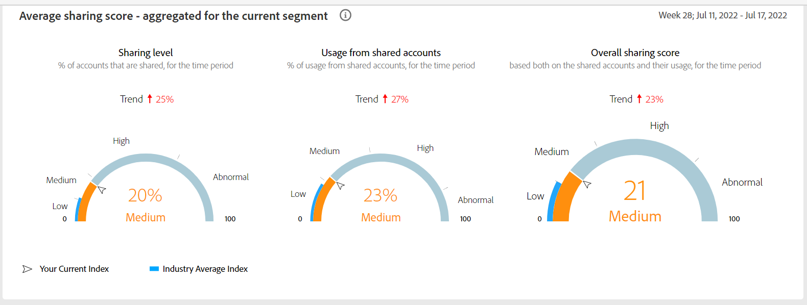

# The dashboard and reports {#dashboard- and-reports}

Account IQ helps MVPDs and programmers understand the risks to their revenue and business operations, and determine the most effective actions to take to mitigate the impacts of credential fraud. It helps MVPDs and programmers uncover password sharing with a high level of confidence, enabling them deliver better business outcomes and provide better viewing experiences for subscribers.
To help MVPDs and programmers better understand password sharing within their businesses, Primetime Account IQ determines a password sharing risk index that rates every subscriber on their likelihood of sharing account credentials for subscription passwords, from very low to very high.

## The dashboard {#dashboard}

The Dashboard tab in helps to pinpoint the instances of password sharing by analyzing the wide array of subscriber data.

The selection panel in the dashboard lets you select the companies (MVPDs and respective programmers) and set a time frame for granularity.

### Aggregated Sharing Score {#aggregated-sharing}

This panel gives deeper insight into user behavior metrics and more detailed insights into patterns of password sharing.

Also known as Aggregated Risk Index or Risk Index and Sharing Risk Index, it is a value that helps users understand the magnitude of password sharing on Programmer properties or by MVPD subscribers and provide them a sense of urgency to act upon it.

### MVPDs in segment {#mvpd-in-segment}

It is a table of risk indices and accounts totals for the top MVPDs ranked by overall usage or account sharing.

### Top MVPDs based on sharing scores {#top-mvpds}

It is a table of risk indices and accounts totals for top MVPDs ranked by the overall usage or account sharing score.

### Sharing score by channels and MVPDs {#sharin-score-by-channels-and-mvpds}

It is the table of overall sharing score of each channel in the segment for top MVPDs.

### Accounts sharing probability {#accounts-sharing-probablity}

It partitions accounts into ranges of sharing probability from very low to very high.

### Number of accounts and usage by sharing probability level {#number-of-accounts-usage-sharing-probablity}

Shows account totals, usage, and trends for accounts partitioned into ranges of sharing probability of very low to very high.

## Reports {#reports}

### General usage reports{#general-usage}

Divide the content in cohorts.

Content filters
device filters

segment and definition replicate to cohorts. Number of people and number of account that ......
content consumption.....

### Shared accounts reports{#shared-accounts}

Total number of users ...

How many accounts are within 99 miles of each other.....and how many are apart. 

Based on points on the map.

 

## Usage patterns {#usage-patterns}

