# The dashboard {#dashboard}

The Dashboard summarizes and aggregates data in a collection of graphs and reports designed to give a high level overview of the scope and impact of account sharing. It provides a single page containing the major reports and metrics from Account IQ.

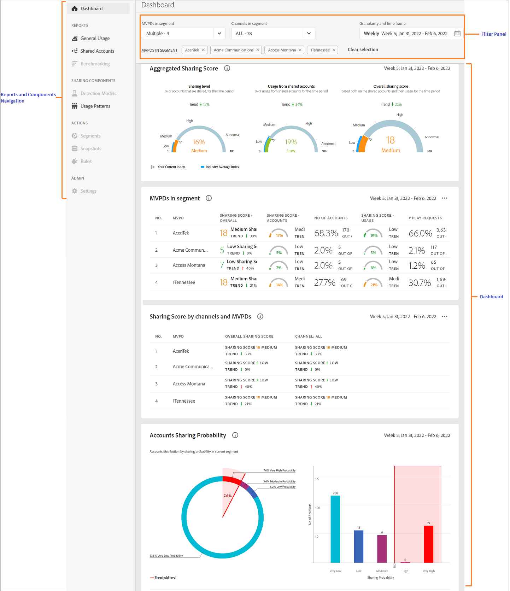

*Figure: The dashboard*

## Average sharing score - aggregated for the current segment {#aggregated-sharing}

The Aggregated Sharing Score panel provides a top line readout summarizing the quantity and impact of sharing in terms of accounts and streaming volume.

The values help you understand the magnitude of credential sharing by your subscribers, hence providing a measure of the need to act upon it.

*Figure: Average sharing score panel - aggregated for the current segment*

The following three metrics are components of the Average Sharing Score.

### Sharing level {#sharing-level}

The sharing level gauge shows the percentage of all your subscriber accounts (in the defined segment) that are shared, during the selected time frame.  

A value calculated based on an average of the sharing probability computed for every account in the set of selected MVPDs that has streamed from a one of the selected programmer channels during the selected time frame.

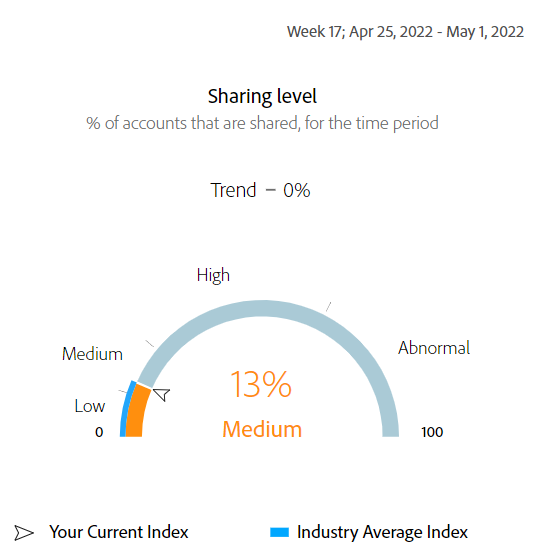

*Figure: Sharing level*

The Trend indicator shows the percentage change in the value of the metric in from the previous time frame.

### Usage from shared accounts {#usage-from-shared-accounts}

This gauge indicates what percent of the usage of all the subscriber accounts is from the shared accounts for the defined segment and time period. The gauge marks the ranges of usage (from shared accounts) on the scale of 0 to 100%. These ranges—named Low, Medium, High, and Abnormal—are based on the industry average.

You can also see the Trend indicator, which depicts a rise or fall in the usage from shared accounts as compared to the previous time frame.

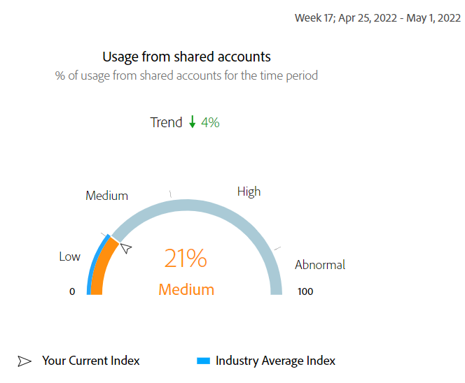

*Figure: Usage from shared accounts*

### Overall sharing score {#overall-sharing-score}

Overall sharing score is composite of sharing scores including “Sharing level” and “z Usage from shared accounts”.

It provides a value meant to reflect the relative impact of sharing when compared to the industry. It’s purpose is similar to that of a credit score, summarizing the situation with a single number. But in this case, the higher the number the greater the potential harm.

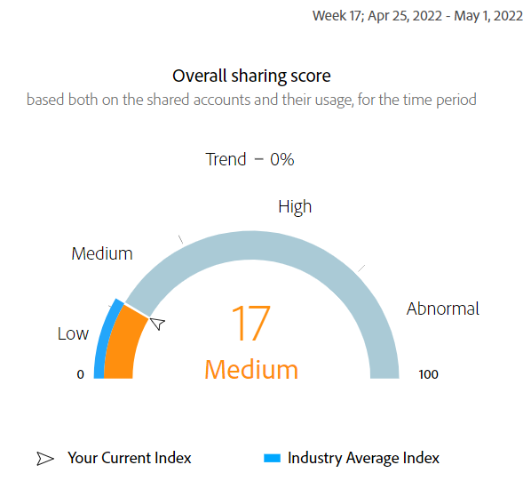

*Figure: Overall sharing score*

<!--### MVPDs in segment {#mvpd-in-segment}

It is a table of risk indices and accounts totals for the top MVPDs ranked by overall usage or account sharing.

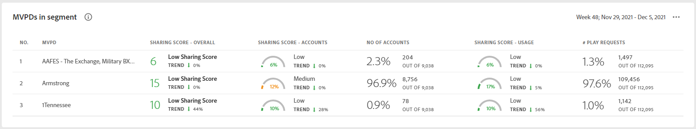-->

## Industrywide overall sharing scores for MVPDs {#top-mvpds}

This table provides a comparative view of the different Aggregated Sharing Scores for the MVPDs in the segment.

>[!NOTE]
>
>This table uses overall industry data for comparative purposes, not the data represented by those MVPDs in the segment.

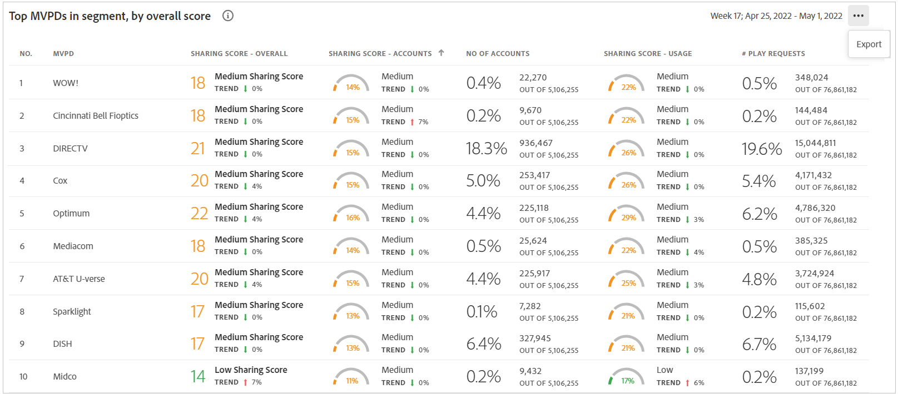

*Figure: Top MVPDs in segment by overall score*

## Sharing score by channels and MVPDs {#sharin-score-by-channels-and-mvpds}

This table provides a comparative view of sharing scores of the selected channels for the MVPDs in the current segment.

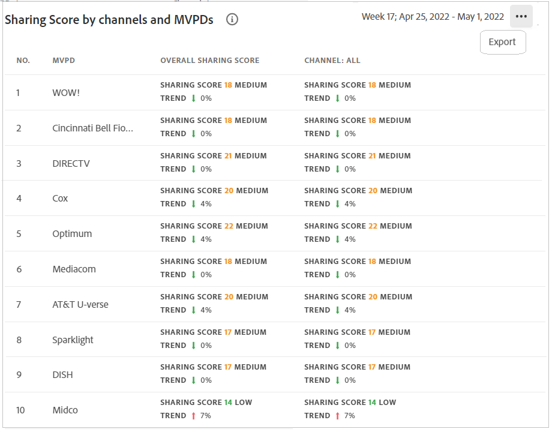

*Figure: Sharing scores by channels and MVPDs*

## Accounts sharing probability {#accounts-sharing-probability}

This chart partitions accounts into ranges of sharing probability quintiles from very low (0-20%) to very high (80=100%).

>[!NOTE]
>
>The bar graph uses a logarithmic scale.

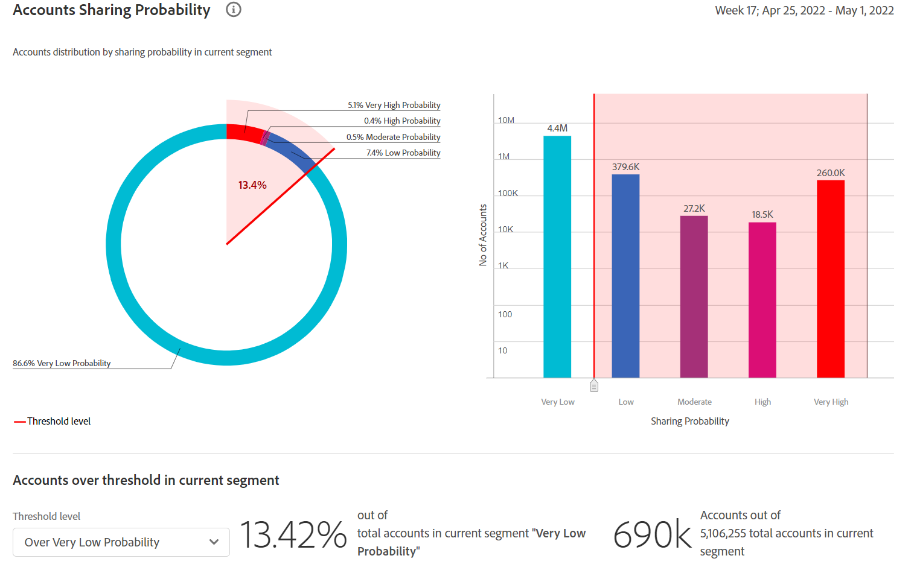

*Figure: Numbers and percentages of subscriber accounts in different sharing probability ranges*

## Number of accounts and usage by sharing probability level {#number-of-accounts-usage-sharing-probability}

This panel provides tabular view of  accounts partitioned into ranges of sharing probability quintiles from very low (0-20%) to very high (80-100%) with each quintile’s associated usage from shared accounts.

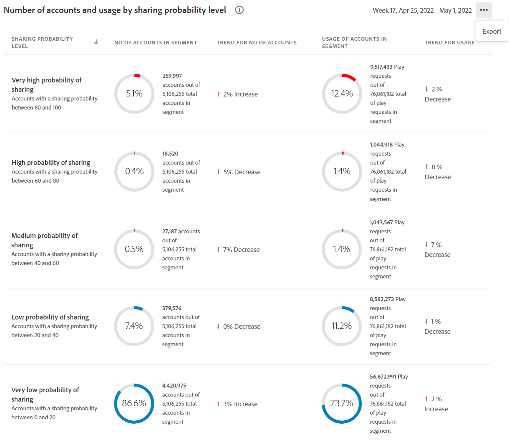

*Figure: Number of accounts, trends, and usages falling in various probability ranges*

<!--
+++Dashboard for programmers

*Figure: The dashboard*

## Average sharing score - aggregated for the current segment {#aggregated-sharing}

The Aggregated Sharing Score panel provides a top line readout summarizing the quantity and impact of sharing in terms of accounts and streaming volume.

The values help you understand the magnitude of credential sharing by your subscribers, hence providing a measure of the need to act upon it.

*Figure: Average sharing score panel - aggregated for the current segment*

The following three metrics are components of the Average Sharing Score.

### Sharing level {#sharing-level}

The sharing level gauge shows the percentage of all your subscriber accounts (in the defined segment) that are shared, during the selected time frame.  

A value calculated based on an average of the sharing probability computed for every account in the set of selected MVPDs that has streamed from a one of the selected programmer channels during the selected time frame.

*Figure: Sharing level*

The Trend indicator shows the percentage change in the value of the metric in from the previous time frame.

### Usage from shared accounts {#usage-from-shared-accounts}

This gauge indicates what percent of the usage of all the subscriber accounts is from the shared accounts for the defined segment and time period. The gauge marks the ranges of usage (from shared accounts) on the scale of 0 to 100%. These ranges—named Low, Medium, High, and Abnormal—are based on the industry average.

You can also see the Trend indicator, which depicts a rise or fall in the usage from shared accounts as compared to the previous time frame.

*Figure: Usage from shared accounts*

### Overall sharing score {#overall-sharing-score}

Overall sharing score is composite of sharing scores including “Sharing level” and “z Usage from shared accounts”.

It provides a value meant to reflect the relative impact of sharing when compared to the industry. It’s purpose is similar to that of a credit score, summarizing the situation with a single number. But in this case, the higher the number the greater the potential harm.

*Figure: Overall sharing score*

<!--### MVPDs in segment {#mvpd-in-segment}

It is a table of risk indices and accounts totals for the top MVPDs ranked by overall usage or account sharing.

### Industrywide overall sharing scores for MVPDs {#top-mvpds}

This table provides a comparative view of the different Aggregated Sharing Scores for the MVPDs in the segment.

>[!NOTE]
>
>This table uses overall industry data for comparative purposes, not the data represented by those MVPDs in the segment.

*Figure: Top MVPDs in segment by overall score*

### Sharing score by channels and MVPDs {#sharin-score-by-channels-and-mvpds}

This table provides a comparative view of sharing scores of the selected channels for the MVPDs in the current segment.

*Figure: Sharing scores by channels and MVPDs*

### Accounts sharing probability {#accounts-sharing-probability}

This chart partitions accounts into ranges of sharing probability quintiles from very low (0-20%) to very high (80=100%).

>[!NOTE]
>
>The bar graph uses a logarithmic scale.

*Figure: Numbers and percentages of subscriber accounts in different sharing probability ranges*

### Number of accounts and usage by sharing probability level {#number-of-accounts-usage-sharing-probability}

This panel provides tabular view of  accounts partitioned into ranges of sharing probability quintiles from very low (0-20%) to very high (80-100%) with each quintile’s associated usage from shared accounts.

*Figure: Number of accounts, trends, and usages falling in various probability ranges*

+++

+++Dashboard for MVPDs
The dashboard for MVPD users is slightly different from those of the programmer users.

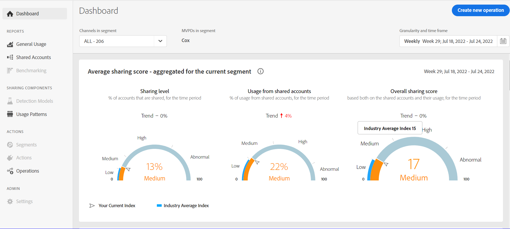

*Figure: MVPD's Dashboard*

## Top programmers in segment by overall sharing score {#}

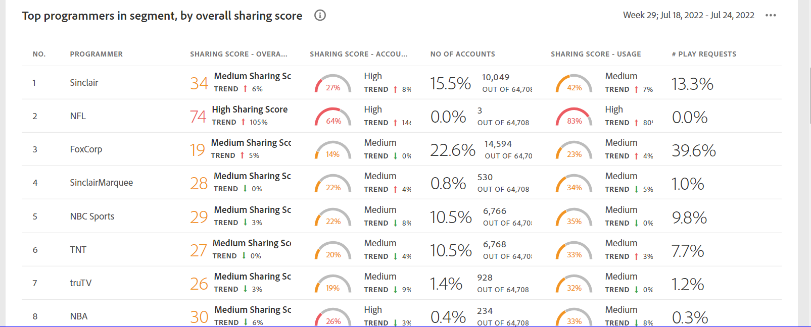

*Figure: Panel showing top programmers in a segment*
+++

+++Dashboard for MVPDs
The dashboard for MVPD users is slightly different from those of the programmer users.

*Figure: MVPD's Dashboard*

## Top programmers in segment by overall sharing score {#}

*Figure: Panel showing top programmers in a segment*
+++
-->