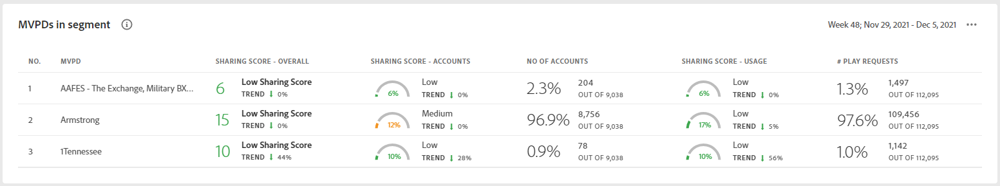
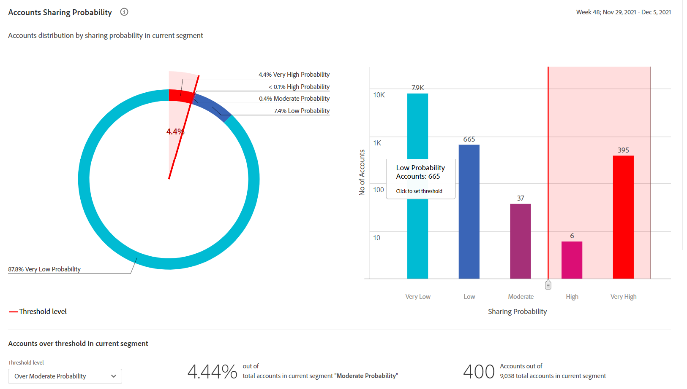
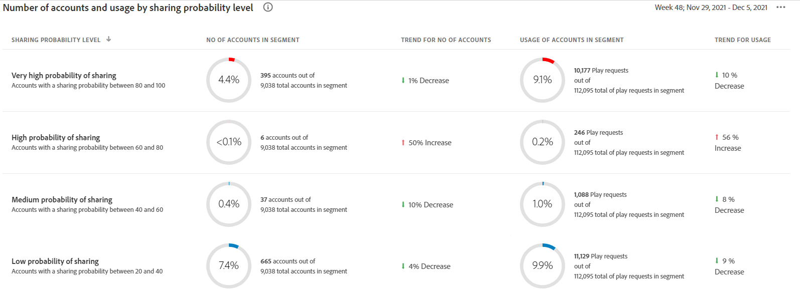

# The dashboard {#dashboard}

<!--The Dashboard helps to pinpoint the instances of password sharing by analyzing an array of subscriber data. It has a collection of visualizations that include gauges and charts, which depict basic to complex metrics.-->
The Dashboard summarizes and aggregates data in a collection of graphs and reports designed to provide a high level insight into the scope and impact of account sharing.

## Aggregated Sharing Score {#aggregated-sharing}

<!--This panel gives deeper insight into user behavior metrics and more detailed insights into patterns of password sharing.->
This panel provides a top line readout summarizing the quantity and impact of sharing in terms of accounts and streaming volume.

Also known as Aggregated Risk Index or Risk Index and Sharing Risk Index, it is a value that helps users understand the magnitude of password sharing on Programmer properties or by MVPD subscribers and provide them a sense of urgency to act upon it.

Sharing level

Usage from shared accounts
Overall sharing score

### MVPDs in segment {#mvpd-in-segment}

It is a table of risk indices and accounts totals for the top MVPDs ranked by overall usage or account sharing.

### Top MVPDs based on sharing scores {#top-mvpds}

It is a table of risk indices and accounts totals for top MVPDs ranked by the overall usage or account sharing score.

### Sharing score by channels and MVPDs {#sharin-score-by-channels-and-mvpds}

It is the table of overall sharing score of each channel in the segment for top MVPDs.

### Accounts sharing probability {#accounts-sharing-probablity}

It partitions accounts into ranges of sharing probability from very low to very high.

### Number of accounts and usage by sharing probability level {#number-of-accounts-usage-sharing-probablity}

Shows account totals, usage, and trends for accounts partitioned into ranges of sharing probability of very low to very high.

