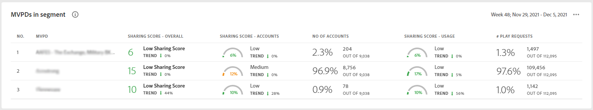

# The dashboard {#dashboard}

The Dashboard summarizes and aggregates data in a collection of graphs and reports designed to give a high level overview of the scope and impact of account sharing. It provides a single page containing the major reports and metrics from Account IQ.

## Aggregated Sharing Score {#aggregated-sharing}

The Aggregated Sharing Score panel provides a top line readout summarizing the quantity and impact of sharing in terms of accounts and streaming volume.

The values help you understand the magnitude of credential sharing by your subscribers, hence providing a measure of the need to act upon it.

The following three metrics are components of the Aggregate Sharing Score.

### Sharing level {#sharing-level}

The sharing level gauge shows the percentage of all your subscriber accounts (in the defined segment) that are shared, during the selected time frame.  

A value calculated based on an average of the sharing probability computed for every account in the set of selected MVPDs that has streamed from a one of the selected programmer channels during the selected time frame.

The Trend indicator shows the percentage change in the value of the metric in from the previous time frame.

### Usage from shared account {#usage-from-shared-accounts}

This gauge indicates what percent of the usage of all the subscriber accounts is from the shared accounts for the defined segment and time period. The gauge marks the ranges of usage (from shared accounts) on the scale of 0 to 100%. These ranges—named Low, Medium, High, and Abnormal—are based on the industry average.

You can also see the Trend indicator, which depicts a dip or plunge in the usage from shared accounts as compared to the previous time frame.

### Overall sharing score {#overall-sharing-score}

Overall sharing score is the probability of credential sharing by the subscribers of MVPDs viewing specific programmer channels in a segment for a specific time period.

It provides a value meant to reflect the relative impact of sharing when compared to the industry. It’s purpose is similar to that of a credit score, summarizing the situation with a single number. But in this case, the higher the number the greater the potential harm.

### MVPDs in segment {#mvpd-in-segment}

It is a table of risk indices and accounts totals for the top MVPDs ranked by overall usage or account sharing.

### Industrywide overall sharing scores for MVPDs {#top-mvpds}

It is a table of risk indices and accounts totals for top MVPDs ranked by the overall usage or account sharing score.

### Sharing score by channels and MVPDs {#sharin-score-by-channels-and-mvpds}

This table provides a comparative view of sharing scores of the selected channels for the MVPDs in the current segment.

### Accounts sharing probability {#accounts-sharing-probability}

It partitions accounts into ranges of sharing probability from very low to very high.

### Number of accounts and usage by sharing probability level {#number-of-accounts-usage-sharing-probability}

Shows account totals, usage, and trends for accounts partitioned into ranges of sharing probability of very low to very high.

