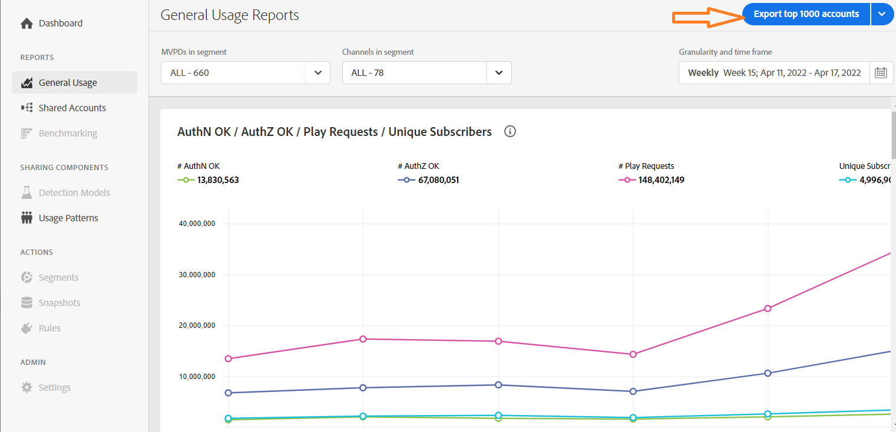

# Export information for accounts with high sharing score {#export-account-info-high-score}

Account IQ gives you the option to export account sharing details for top 1000 subscriber accounts based on their [sharing probabilities](/help/AccountIQ/product-concepts.md#account-sharing-probability-def. The data in the exported CSV file is sorted in the decreasing order of the sharing probabilities of the subscriber accounts—of the selected MVPDs in the [segment](/help/AccountIQ/product-concepts.md#segmet-def), for a [specified time frame](/help/AccountIQ/product-concepts.md#time-frame-def).

The option to export the account sharing information is available on [General Usage Reports](help/AccountIQ/reports.md#general-usage) and [Shared Accounts Reports](/help/AccountIQ/reports.md#shared-accounts) pages.

>[!NOTE]
>
>The numbers in the downloaded CSV file are different for the ones in General Usage and Shared Accounts reports, because of the differnces in the Threashhold filter.

## Process

To export the 

When you use the export option, the statistics for 1000 accounts with the highest sharing probabilities (for a defined time frame) are downloaded to the local Download folder of your Windows machine.

>[!NOTE]
>
>The downloaded CSV file can be opened using any application that reads CSV file, for example Microsoft Excel.

## Columns in the exported report {#columns-in-export}

**Week/ Month**

The week or the month, which you selected on the **Granularity and Time Frame** option in the segment selector, for which the sharing statistics are sought.

**MVPD**

If you are a programmer user, the column shows which MVPD does the subscriber account belong to.

**Subscriber Id**

Specific account which we are talking about in a row.

**Minimum # Devices**

The absolute minimum number of devices that have streamed content for the period.

>[!NOTE]
>
>The actual number of devices (that stream content) is certainly greater than the Minimum # of devices, specified for a particular account.

**Minimum # Persons**

The absolute minimum number of people that were active streaming content using those devices.

>[!NOTE]
>
>The actual number of persons (that stream content) is certainly greater than the Minimum # of persons, specified for a particular account.

**# IPs**

Number of IP address that the content has streamed for.

**#Locations**

Locations from which the streaming occurred based on the Zip code.

**#Cities**

Number of cities where the streaming has taken place.

**#States**

Number of states where the streaming has taken place.

**#Clusters**

[Cluters](/help/AccountIQ/product-concepts.md#cluster-def) are....

**Geographic span (miles)**

The maximum distance between the locations associated with the account.

**# AuthN OK**

The number of times that the users have logged-in during the period, using that account.

**# AuthZ OK**

Number of times an MVPD has authorized a stream, or granted access (to content), to that account.

>[!NOTE]
>
>The **# AuthZ OK** is related to the **# Play Requests**; it is smaller that the **# Play Requests** because Adobe caches the authorizations that come for MVPDs for 24 hours.

**# Play Requests**

The actual number of streams during the time period.

**# Channels**

Total number of different channels that the account has watched over the time period.

>[!NOTE]
>
>**# Channels** includes the channels that not necessarily belonged to the logged-in programmer.
>
>This number for the account showed up because the account watched your channel, but it also accessed other channels during that time period.

**Usage Pattern**

The numbers in this column are identifiers that map to one of the 14 patterns that we identify all the user accounts as.

 | ID | 1 | 2 | 3 | 4 | 5 | 6 | 7 | 8 | 9-11 | 12 | 13 | 14 |
 |---|---|---|---|---|---|---|---|---|---|---|---|---|
 | Usage Patterns | Regular user | Traveler or commuter | Large family | Close family and friends | Social group sharing | Large group of friends | Concurrent streaming | Community sharing | Uncertain behavior | Small family | Second home | Abnormal Usage |
 

**Sharing Probability**

It equates to the probability that the specific account is sharing its credentials.

>[!NOTE]
>
> The average of the sharing probability of all the accounts (in the selected segment) is used to compute the [sharing level](/help/AccountIQ/dashboard.md#sharing-level) of the [Aggregated sharing score](/help/AccountIQ/dashboard.md#aggregated-sharing).
