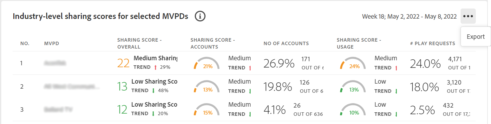

# Export metrics for MVPDs and channels in a segment {#export-metric}

The Dashboard in Account IQ displays tables and graphs for credential sharing statistics of the subscriber accounts in the selected segment. Apart from viewing the sharing patterns and scores, you can also export the account usage metrics and sharing scores for the subscribers of the MVPDs and channels in the selected segment from these tables.

To export metrics for MVPDs and channels in a selected segment, once you are logged in as an authorized programmer user:

1. Define a desired segment following the steps in [How to define segment and select timeframe](/help/AccountIQ/howto-select-segment-timeframe.md) for evaluation from [segment and timeframe](/help/AccountIQ/segments-timeframe.md) panel.

1. Go to one of the following panels:

    * Industry-level sharing scores for selected MVPDs
    

    * Sharing Score by channels and MVPDs in the segment

      

    * Number of accounts and usage by sharing probability level

      

1. Select **Export** option available in the upper-right corner of the panel.

The data is exported in CSV format, and the file is downloaded locally on your device. You can use desired CSV viewer and editor to open the exported reports.

* Industry-level sharing scores for selected MVPDs

    

* Sharing Score by channels and MVPDs in the segment

    
     
* Number of accounts and usage by sharing probability level

    
