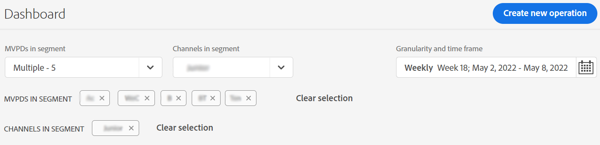
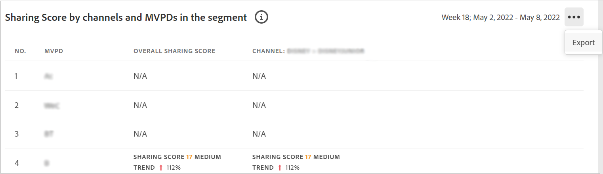
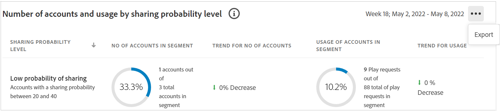

# Export metrics for MVPDs and channels in a segment {#export-metric}

Dashboard in Account IQ displays tables and graphs for credential sharing statistics of various subscriber accounts from a selected segment. Apart from viewing the sharing patterns and scores, you can also export the account usage metrics and sharing scores for various subscribers of MVPDs in the the selected segment from these tables.

To export metrics for MVPDs and channels in a selected segment, once you are logged in as an authorized programmer user:

1. Select the MVPDs (from **MVPDs in segment** option) for which you want to export subscriber statistics and select **Apply selection**. For example, you selected five MVPDs.

   * Either select **All**, or either of the **Top 10 MVPDs** (by sharing score, usage, or accounts), or select the individual MVPDs.
   * If you want to select individual MVPDs, then deselect **All** and select the MVPDs one by one.

1. Select the desired programmer channels (from **Channels in segment** option). For example, you selected a channel named LN.

   >[!NOTE]
   >
   >The selected MVPDs and Channels are listed under the MVPD and channel selectors. Also there is an option to **Clear selection** next to the listed items.

   

1. Select a timeframe for evaluation from **Granularity and time frame** option.

    1. Use **Aggregated By** option to select the granularity of your evaluation as a Week or a Month.

    1. After specifying the granularity select the desired timeframe, either a week or a month (based on the granuarity you selected).

    1. Select **Apply**.

1. Go to either of the following panels:

    * Industry-level sharing scores for selected MVPDs
    

    * Sharing Score by channels and MVPDs in the segment

      

    * Number of accounts and usage by sharing probability level

      

1. Select **Export** option available in the upper-right corner of the panel.

The data is exported in CSV format, and the file is downloaded locally on your device. You can use desired CSV viewer and editor to open the exported reports.

* Industry-level sharing scores for selected MVPDs

    

* Sharing Score by channels and MVPDs in the segment

    
     
* Number of accounts and usage by sharing probability level

    

