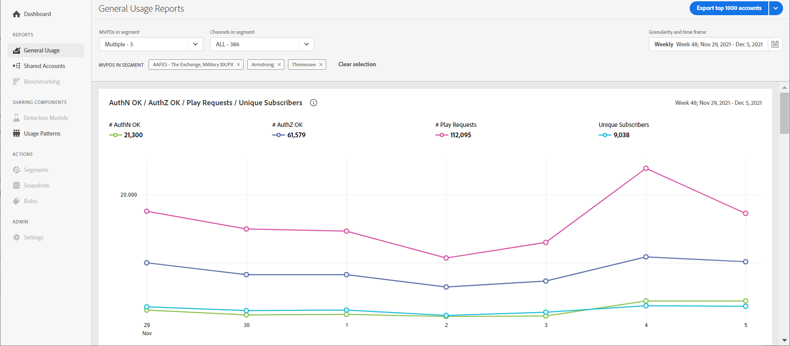
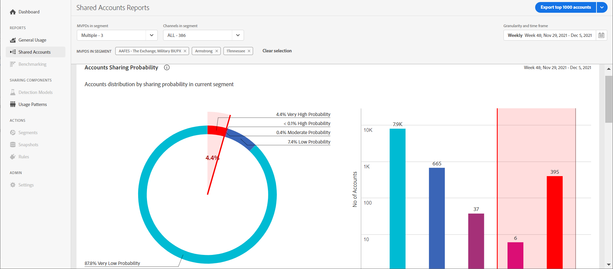

# General Usage reports {#general-usage-reports}

Account IQ reports provide basic analytic tools and reports that let you drill into your data to isolate [cohorts](/help/AccountIQ/product-concepts.md#segmet-def), identify anomalies, and build an understanding of your account characteristics.

## General usage reports{#general-usage}

General Usage provides tools to carve out subgroups metrics based on the number of account devices in use, IPs detected, and respective zip codes.

Divide the content in cohorts.

Content filters
device filters

segment and definition replicate to cohorts. Number of people and number of account that ......
content consumption.....

## Shared accounts reports{#shared-accounts}

Shared Accounts breaks down metrics such as number of devices and device types by the selected range of sharing probability (e.g., “Over Moderate Probability”).

Total number of users ...

How many accounts are within 99 miles of each other.....and how many are apart. 

Based on points on the map.

