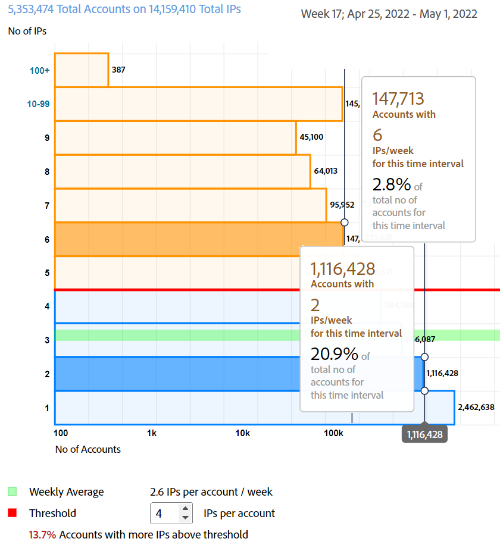

# General Usage reports {#general-usage-reports}

Account IQ reports are basic analytic tools and reports that let you drill into your data to isolate [cohorts](/help/AccountIQ/product-concepts.md#segmet-def), identify anomalies, and build an understanding of your account characteristics.

General Usage reports page provides tools to carve out subgroups metrics based on the number of account devices in use, IPs detected, and respective zip codes.

<!--Divide the content in cohorts.

Content filters
device filters

segment and definition replicate to cohorts. Number of people and number of account that ......
content consumption.....-->

The reports are all based on the current segment selected using [Segments and time frame](/help/AccountIQ/howto-select-segment-timeframe.md panel. You can fine tune your selection and further narrow it down by specifying (number of devices, number of IPs, and number of zip codes) thresholds in [Snapshot Overview - Accounts above thresholds](#snapshot-overview) panel.

<!--To view General Usage Reports:

1. Select the desired MVPDs from the **MVPDs in Segment** option.

2. Select the desired programmer channels from the **Channels in Segment** Option.

3. Select an appropriate time frame from the **Granularity and time frame** option.

   Using the above options you have defined segments for your analysis. Based on your segment selection, following graphs and reports are displayed.

4. You can fine tune your selection and further narrow it down by specifying (number of devices, number of IPs, and number of zip codes) thresholds in [Snapshot Overview - Accounts above thresholds](#snapshot-overview) widget/panel.-->

## AuthN OK / AuthZ OK / Play Requests / Unique Subscribers {#authn-authz-playreq-uniquesubs}

The line graphs here gives you a view of the changes over time in values of AuthN OK, AuthZ OK, Play Requests, and Unique Subscribers in a selected time frame for the defined segment.

The x-axis presents the units within the current time frame and the y-axis represents basic subscriber activity metrics during that period. The line graphs lets you compare the following values for the subscribers of MVPDs and channels you selected in the segment selection panel:

* **AuthN OK**

    AuthN OK is the number of successful authentications. For more information and definition see [Product concepts: AuthN OK](/help/AccountIQ/product-concepts.md#authn-ok-def).

* **AuthZ OK**
  
    AuthZ OK is the number of successful authorizations. For more information and definition see [Product concepts: AuthZ OK](/help/AccountIQ/product-concepts.md#authz-ok-def).

* **Play Requests**

    Play requests are the number of Play Requests. For more information and definition see [Product concepts: Play requests](/help/AccountIQ/product-concepts.md#play-requests-def)

* **Unique Subscribers**

    Unique subscribers are the number of successful unique subscribers. For more information and definition see [Product concepts: Unique subscribers](/help/AccountIQ/product-concepts.md#unique-subscriber-def)

    >[!NOTE]
    >
    >The total number of unique subscribers also include the number of unique devices if a programmer's use of Adobe TempPass (i.e. free preview) is part of the segment.

## Snapshot Overview - Accounts above thresholds {#snapshot-overview}

Fine tune your analytics and reports using this additional filter to set various usage thresholds. Once you define your segment (or cohort) for analysis by selecting the desired MVPD(s) and channels, you can also use following filters for to analyze subscribers behavior:

* Number of Devices Threshold

* Number of IPs Threshold

* Number of Zip Codes Threshold

When you update threshold values in [Accounts Segment - based on selected thresholds](#account-segments-basedon-segments) panel, you can view the affect in:

* [Devices per week (or month) per account](#devices-week-account)

* [Locations per week (or month) per account](#locations-week-account)

* [IPs per week (or month) per account](#ip-week-account)

* [Historical view of accounts segment](#account-segment-historical-view)

>[!NOTE]
>
>The default value for each of the thresholds is 4. Which means, the General Usage page shows analysis for MVPDs with subscribers using four (and more than four) devices, consuming content from four (and more) different geographical locations and four (and more) different zip codes.

### Accounts Segment - based on selected thresholds {#account-segments-basedon-segments}

The **Accounts Segment - based on selected thresholds** panel gives you options to set thresholds (between 1 and 10) for number of devices, number of IPs, and number of Zip codes.

The graph shows you the:

* absolute number of subscriber accounts, and

* percentage out of the total subscriber accounts in that segment,

  that are using X number of devices, Y number of IPs, and Z number of Zip codes to consume content from your channel for the (defined segment of) MVPDs, for a time frame.

## Devices per week (or month) per Account {#devices-week-account}

The **bar graph** provides insights into usage behavior in terms of how the subscribers of your MVPDs are using their devices to access content from your channel.

The x-axis plots Number of Accounts, and y-axis plots Number of Devices. Based on the threshold you set for number of devices per account, it marks the absolute number of subscriber accounts consuming content from specific number of devices in a week's duration.  

When hovering over a bar (specific to number of devices), a label appears that gives information about the number of subscriber accounts (and the percentage out of total subscriber accounts in segment) that are streaming channel content using those many devices in a week.

The graph also marks the following:

* A red line to mark the threshold you set.

* A green line to mark the average of the number of different devices used by a subscriber account per week (or month).

You can compare the level of threshold with weekly average of number of different devices used by an account, to judge the level of sharing.

The graph also gives a glimpse of the percentage of subscriber accounts that are using more number of devices than the set threshold.

The donut chart helps you judge the magnitude of subscriber accounts consuming channel content using devices more than the set threshold (in a timeframe) at a glance.

## Locations per week (or month) per Account {#locations-week-account}

Like [Devices per week (or month) per Account](#devices-week-account), the Locations per week (or month) per Account metric help you analyze the subscriber account usage from different locations, to more closely identify password sharing. The x-axis plots Number of Accounts, and y-axis plots Number of Locations.

Results from this metric combined with number of [Devices per week (or month) per Account](#devices-week-account) and number of [IPs per week (or month) per Account](#ip-week-account) help you more accurately judge the password sharing instances; such that authentic users are not counted in.

Once you have defined a segment (by selecting MVPDs and channels) and set the threshold for number of locations, you can identify from the graph:

* Number (and percentage) of subscribers that are consuming content from (a specific) x number of locations in a week.

* Percentage of total subscriber accounts that are viewing content from more locations than the threshold.

* Compare the weekly average (number of different locations for an account) with Threshold.

## IPs per week (or month) per Account {#ip-week-account}

Similar to [Devices per week (or month) per Account](#devices-week-account) and [Locations per week (or month) per Account](#locations-week-account), the **Number of IPs per week (or month) per account** metric lets you analyze password sharing more precisely and with more granularity.

The x-axis plots Number of Accounts, and y-axis plots Number of IPs. When you analyze how multiple IP addresses are used to consume content by the same subscriber, it adds more value to your subscribers' usage analysis.

Once you have defined a segment (by selecting MVPDs and channels) and set the threshold for number of IPs, you can identify from the graph:

* Number (and percentage) of subscribers that are consuming content from (a specific) x number of IP in a week.

* Percentage of total subscriber accounts that are viewing content from more IP addresses than the threshold.

* Compare the weekly average (number of different IPs for an account) with Threshold.

## Accounts Segment - Historical View {#account-segment-historical-view}

The Historical View bar graph helps you compare the usage metrics across different time frames. Also, it collectively plots the various usage metrics, such as [Devices per week (or month) per Account](#devices-week-account), [Locations per week (or month) per Account](#locations-week-account), and [IPs per week (or month) per Account](#ip-week-account).

* The x-axis plots the time frame, and y- axis plots number of subscriber accounts.

* The orange colored bars signify segments in various time frames.

* The line graph plots the changes in [Devices per week (or month) per Account](#devices-week-account), [Locations per week (or month) per Account](#locations-week-account), and [IPs per week (or month) per Account](#ip-week-account) values across the time frame based on the threshold.

* The blue bars signify the total number of active subscribers across the industry for a time frame.

* You can select specific legends, and they help you scale the graph.

>[!MORELIKETHIS]
>
>* Know how to export reports for top 1000 subscribers for selected MVPDs using filters in General Usage Report using [Export top 1000 accounts](/help/AccountIQ/export-acc-information.md) option.
