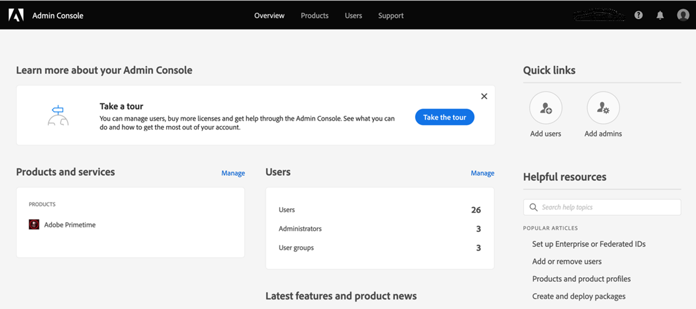
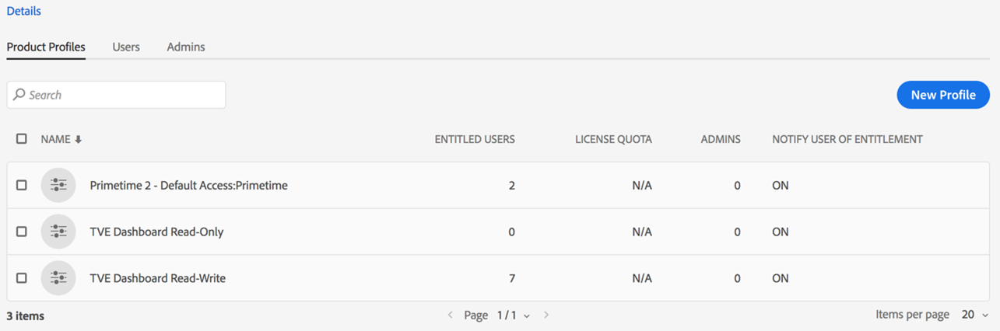
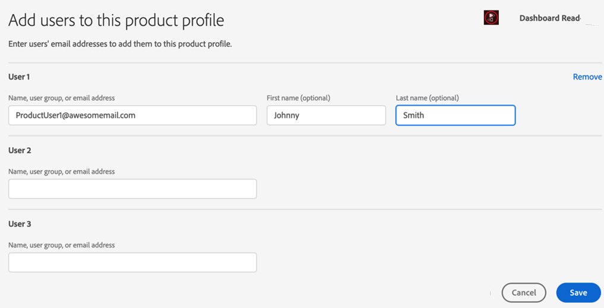

# How to onboard and get started with Account IQ {#onboard}

Account IQ is a hosted web application. To begin using this analytics tool as a D2C streaming provider, programmer, or distributor (MVPD) and mitigate credential sharing, you need to get your organization onboarded on Adobe Experience Cloud organizations and assign organization users to **Primetime Account IQ** profile on [Adobe Admin Console](https://adminconsole.adobe.com/). Read on to know the pre-requisites and details to onboard.

## Browser prerequisites {#browser-prerequisites}

Account IQ is compatible with the most recent versions of the following browsers:

* Google Chrome
* Safari
* Mozilla Firefox

## Steps to onboard {#steps-to-onboard}

1. To get your organization registered in **Adobe Experience Cloud** organizations contact **Adobe** by sending an email to tve-support@adobe.com.

1. Assign organization users to **TVE Dashboard Read-Write** or **TVE Dashboard Read Only** profiles in [Adobe Admin Console](https://adminconsole.adobe.com/).

   The Admin users in your organization can create users and grant them access to Account IQ Dashboard and Reports. To grant organization users access to Account IQ, organization Admins need to:

    1. Log in to [Adobe Admin Console](https://adminconsole.adobe.com/).

        

    1. Select **Adobe Primetime** from **Products and services**.

    1. From **Product Profiles**, select either **TVE Dashboard Read-Write** or **TVE Dashboard Read Only** profile.

       

       >[!NOTE]
       >
       >In near future, Primetime Account IQ will split from TVE Dashboard.

    1. From here you can create user groups, or select existing groups to add users to.

       

    1. Select **Add User** option to add users.

>[!IMPORTANT]
>
>If your users are not able to access Account IQ dashboard, contact Adobe support to make sure that your organization's ID is whitelisted in Account IQ.
