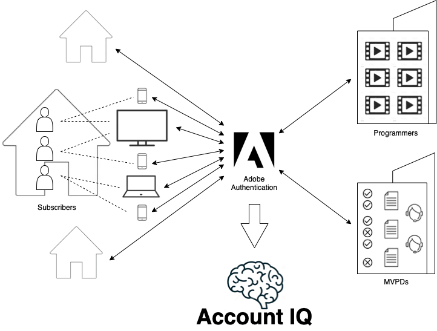

# Account IQ overview {#account-iq-overview}

Credential sharing by streaming service subscribers is a major and growing problem for the industry. To add to it, understanding, identifying, and acting on credential sharing is a complex process. There is complexity involved in understanding the subscriber usage behavior and in developing a holistic view of their activity—for example, distinguishing sharing among members within the same household and outside. Due to this challenge, streaming service providers have inhibitions in acting against credential sharing.

Generally, video streaming service providers understand the risk and cost of sharing to their business but have limited remedies, such as blocking the sharers. However, an informed and targeted approach is recommended – one that enables services to understand sharing accurately and to adopt strategies that reward good viewing behavior and simultaneously target business growth.

Adobe Primetime Account IQ enables video streaming services to understand the subscriber usage patterns and identify credential sharing. By deeply analyzing the long trail of data left behind by each subscriber using Adobe’s proprietary multi-layer machine learning model, streaming services can understand usage behavior and identify credential sharing with a greater degree of certainty. Moreover, it enables action to be taken through integrations with other systems such as limiting concurrent streams or customizing offers, and validates the impact of those actions – whether encouraging legitimate viewing behavior or growing subscribers and revenue.

*Figure: Account IQ information flow*

Account IQ provides the tools and features to measure, manage, and monetize credential sharing. Reports, analytics, and dashboards enable exploration of the data to identify patterns. Direct action is supported through exports and integrations with Adobe and 3rd party systems such as campaign management, currency limiting or subscriber registration. And dedicated tracking tools measure the success of those actions so they can be updated or expanded.
The Account IQ application tools and features are explained in the following sections:

* [Dashboard](/help/AccountIQ/dashboard.md)
* [General Usage reports](/help/AccountIQ/general-usage-reports.md)
* [Shared Accounts reports](/help/AccountIQ/shared-acc-reports.md)
* [Usage Patterns](/help/AccountIQ/usage-patterns.md)
* [Operations](/help/AccountIQ/operations.md)

Let's take a deep dive into the graphs and reports in each of these sections.

>[!MORELIKETHIS]
>
>* [How to get started with Account IQ](/help/AccountIQ/get-started.md)
>* [Dashboard](/help/AccountIQ/dashboard.md)
>* [General usage reports](/help/AccountIQ/general-usage-reports.md)
>* [Shared accounts reports](/help/AccountIQ/shared-acc-reports.md)
>* [Usage patterns](/help/AccountIQ/usage-patterns.md)
>* [Glossary of product terms](/help/AccountIQ/product-concepts.md)
>* [Account IQ whitepaper](https://www.adobe.com/content/dam/dx/us/en/products/primetime/resources/primetime-account-iq-whitepaper.pdf)

<!-- Credential sharing is rampant and prevalent among subscribers in the video streaming industry. To add to it, understanding, identifying, and acting on password sharing is a complex process. There is complexity involved in understanding the subscriber usage behavior and developing a holistic view of viewer activity—for example, distinguishing sharing among members within the same household and outside. Due to this challenge, streaming service providers have inhibitions in acting against password sharing.

Generally, video streaming service providers consider password sharing as fatal for business and act strongly against it, by blocking the sharers. However, it is advised to follow a holistic approach that enables them to understand sharing accurately and adopt strategies to reward good viewing behavior and target business growth simultaneously.

*Figure: Account IQ information flow*

Adobe Primetime Account IQ enables video streaming services understand the subscriber usage patterns and identify password sharing by analyzing usage behavior. Moreover, it validates the impact of applying actions to encourage legitimate viewing behavior while maximizing business ROI, eventually growing subscribers and revenue.

By deeply analyzing the long, winding trail of data left behind by each subscriber using Adobe’s proprietary multi-layer machine learning model, customers can understand usage behavior and identify password sharing with a greater degree of certainty, use the insights to validate the impact of applying actions to encourage legitimate viewing behavior while maximizing business growth, eventually act on password sharing using validated tactics to improve viewer experience, growing subscribers and revenue (for e.g. converting sharers to paid subscribers, managing ad loads based on sharing behavior, rewarding good behavior with better viewer experience).

Account IQ is helps you understand usage patterns and identify password sharing by leveraging the Primetime Authentication  solution that processes a huge volume of TV Everywhere transactions. A proprietary multi-layer machine learning model trained by this real-world TVE data accurately characterizes usage patterns and helps video streaming services understand usage patterns and identify password sharing at an individual account level. Based on Adobe’s customer experience management solutions, Account IQ enables video streaming services to effectively use their audience data to create actionable sharing profiles as well powers integrations with other Adobe Digital Experience and 3rd party solutions—for example, Adobe Primetime Concurrency Monitoring or Adobe Analytics—to enable understanding usage patterns, identify and act upon password sharing.

<!-- The widespread availability of video content and streaming services bring with it problem of account sharing; eventually leading to the loss of revenue by content providers. Account IQ helps TV Everywhere and VOD (video on demand) providers understand the risks to their revenue and business operations, and determine the most effective actions to take to mitigate the impacts of credential fraud. It helps these media companies (MVPDs, Programmers, and VOD providers) manage and uncover the instances of password sharing with a high level of confidence, enabling them deliver better business outcomes and provide better viewing experiences for subscribers.

To help media companies better understand the password sharing within their businesses, Primetime Account IQ determines **Password Sharing Risk Index** that rates every subscriber on their likelihood of sharing account credentials for subscription passwords, from very low to very high. Based on these calculations and the resulting indices, analytics are performed and visuals are generated for better understanding and interpretation of the account sharing behavior. Account IQ is a hosted web application, which you can access using your browser.

Account IQ assigns sharing scores to different subscriber accounts, so that the content providers (media companies, programmers, MVPDs, and VOD providers) can take informed decisions about subscriber accounts and check the illicit sharing.

Passwords are the main methods for viewers to authenticate, and there is a misconception that credential sharing is allowed. This idea makes illicit password sharing a common practice; necessitating the need for media companies to educate their viewers about permissible sharing and prevent illicit sharing.-->

