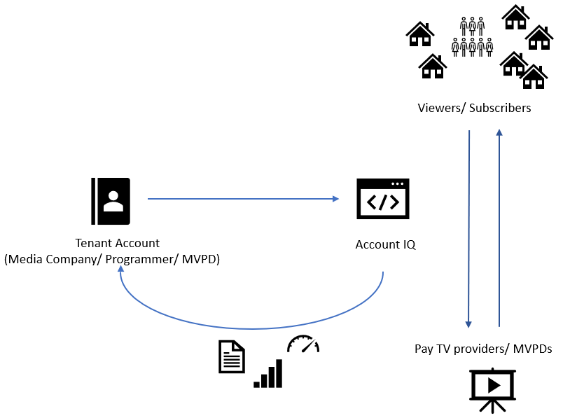

# Account IQ overview {#account-iq-overview}

The widespread availability of video content and streaming services bring with it problem of account sharing; eventually leading to the loss of revenue by content providers. Account IQ helps TV Everywhere and VOD (video on demand) providers understand the risks to their revenue and business operations, and determine the most effective actions to take to mitigate the impacts of credential fraud. It helps these media companies (MVPDs, Programmers, and VOD providers) manage and uncover the instances of password sharing with a high level of confidence, enabling them deliver better business outcomes and provide better viewing experiences for subscribers.

To help media companies better understand the password sharing within their businesses, Primetime Account IQ determines **Password Sharing Risk Index** that rates every subscriber on their likelihood of sharing account credentials for subscription passwords, from very low to very high. Based on these calculations and the resulting indices, analytics are performed and visuals are generated for better understanding and interpretation of the account sharing behavior. Account IQ is a hosted web application, which you can access using your browser.

Account IQ assigns sharing scores to different subscriber accounts, so that the content providers (media companies, programmers, MVPDs, and VOD providers) can take informed decisions about subscriber accounts and check the illicit sharing.

Passwords are the main methods for viewers to authenticate, and there is a misconception that credential sharing is allowed. This idea makes illicit password sharing a common practice; necessitating the need for media companies to educate their viewers about permissible sharing and prevent illicit sharing.

The Account IQ application has the following sections:

* [Dashboard](/help/AccountIQ/dashboard.md)
* [General Usage](/help/AccountIQ/reports.md#general-usage)
* [Shared Accounts](/help/AccountIQ/reports.md#shared-accounts)
* [Usage Patterns](/help/AccountIQ/usage-patterns.md)

Let's take a deep dive into the graphs and reports in each of these sections.

>[!MORELIKETHIS]
>
>* [How to get started with Account IQ](/help/AccountIQ/get-started.md)
>* [Dashboard](/help/AccountIQ/dashboard.md)
>* [Reports](/help/AccountIQ/reports.md)
>* [Usage patterns](/help/AccountIQ/usage-patterns.md)
>* [Glossary of product terms](/help/AccountIQ/product-concepts.md)
>* [Account IQ whitepaper](https://www.adobe.com/content/dam/dx/us/en/products/primetime/resources/primetime-account-iq-whitepaper.pdf)