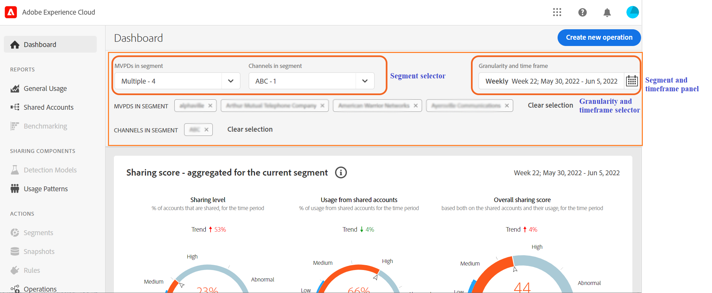

# How to define segment in Account IQ: using segment and timeframe panel {#define-segment}
All analysis or viewing reports in Account IQ begin with defining segment and selecting timeframe for evaluation. [Segment](/help/AccountIQ/product-concepts.md#segmet-def) refers to all the subscribers or viewers that meet your criteria (subscribing to an MVPD and viewing sepcific channels) of evaluation.

*Figure: Segment and timeframe selection*
At the top of all the reports pages on Account IQ, there is a panel to define segment by selecting MVPDs, channel programmers, and granularity and time frame.
## Segment selection {#select-segment}
### Select MVPDs in segment {#select-segment-mvpds}
To select MVPDs from **MVPDs in segment** option:
1. Select the **MVPDs in segment** dropdown option.
   >[!NOTE]
   >
   >**All** industry MVPDs are selected by default. From here, you can select either of the **Top 10 MVPDs by sharing score**, **Top 10 MVPDs by usage**, **Top 10 MVPDs by accounts**. or individual MVPDs. However, to select individual MVPDs you need to deselect **All**.
1. Select the desired MVPDs.
    You can remove an MVPD from the selection by deselecting it.
1. Select **Apply selection** for your selection to take effect. Otherwise, you will loose your selection.
   >[!NOTE]
   >
   >If you select Isolation mode, then none of the other MVPDs can be selected.
### Select channels in segment {#select-segment-channels}
To select the desired programmer channels from the **Channels in segment** option:
1. Select the **Channels in segment** dropdown option.
   >[!NOTE]
   >
   >**All** programmer channels for your company are selected by default. To select individual channels or programmers you must first deselect **All**.
1. Select the desired programmers or channels. You can either select individual channels the programmers.
   >[!NOTE]
   >
   >When you select a programmer, all the activity of the channels under that programmer will be included in report and graph results
1. Select **Apply selection** for your selection to take effect.

>[!IMPORTANT]
>
>Selecting individual channels is not the same as selecting a programmer.
When you select individual channels, those channels activity will be broken down individually in some reports. When you select the parent programmer of all those channels, all of the activity of those channels are included but are not broken down individually on reports.

>[!NOTE]
>
>You cannot select more than 10 items in the MVPD or programmer pulldown menus.

Another way to change selection is to deselect the any of the previously selected MVPDs and channels. in the segment nd timeframe panel. Or you can clear the entire selection, and defaults you back to All.
## Granularity and timeframe selection {#granularity-timeframe}

To select a time period of evaluation:

1. Select the **Granularity and time frame** dropdown option.

1. Select either **Week** or **Month** from **Aggregate by** option to set granularity for your evaluation. Once  for evaluation you select either a past month or a past week.

1. Once you have selected granularity, then you can use forward or back arrows to move forward or backward in time.

1. Once you select a particular month or week make sure to select Apply Selection to make sure your selection takes effect.

Another way to change selection is to deselct the any of the previously selected MVPDs and channels. in the segment nd timeframe panel. Or you can clear the entire selection, and defaults you back to All.