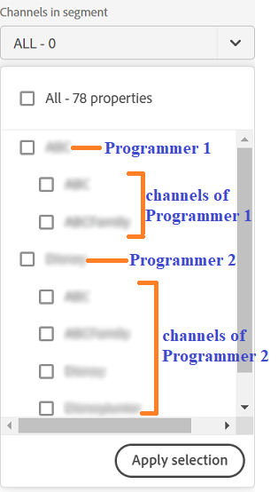
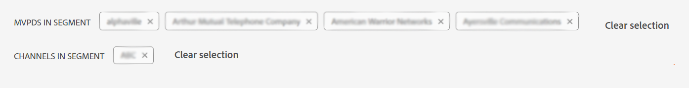
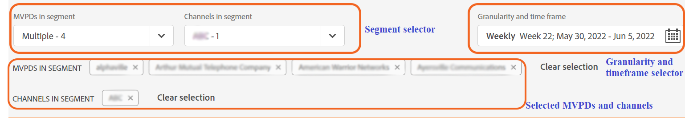
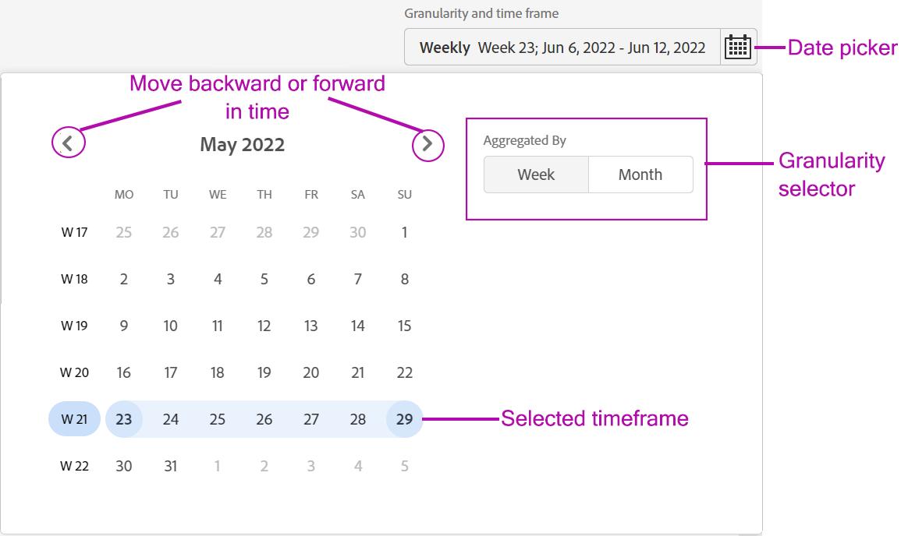

# Define a segment and time frame {#define-segment}

All analysis or viewing reports in Account IQ begin with defining segment and selecting time frame for evaluation. [Segment](/help/AccountIQ/product-concepts.md#segmet-def) refers to all the subscribers or viewers that meet your criteria (subscribing to an MVPD and viewing sepcific channels) of evaluation.

*Figure: Segment and time frame selection*

At the top of all the reports pages in Account IQ, there is a panel to define segment by selecting MVPDs, channel programmers, and granularity and time frame.

## Segment selection {#select-segment}

### Select MVPDs in segment {#select-segment-mvpds}

To select MVPDs from **MVPDs in segment** option:

1. Click or tap the **MVPDs in segment** dropdown option.

   >[!NOTE]
   >
   >**All** industry MVPDs are selected by default. From here, you can select either of the **Top 10 MVPDs by sharing score**, **Top 10 MVPDs by usage**, **Top 10 MVPDs by accounts**, or individual MVPDs. However, to select individual MVPDs you need to deselect **All**.

1. Click or tap the desired MVPDs.

    You can remove an MVPD from the selection by deselecting it.

1. Click or tap **Apply selection** for your selection to take effect. Otherwise, you will loose the selection you made.

   >[!NOTE]
   >
   >If you select Isolation mode, then none of the other MVPDs can be selected.

### Select channels in segment {#select-segment-channels}

To select the desired programmer channels from the **Channels in segment** option:

1. Click or tap the **Channels in segment** dropdown option.

   >[!NOTE]
   >
   >**All** programmer channels for your company are selected by default. To select individual channels or programmers you must first deselect **All**.

1. Click or tap the desired channels or programmers.

   The top level list items in the **Channels in segment** are [programmer](/help/AccountIQ/product-concepts.md#programmer-def) companies and the list items under programmer names are their [channels](/help/AccountIQ/product-concepts.md#channel-def). You can either select individual channels under programmers, or select programmers and all the activities of the channels under that programmer are included in report and graph results.

   

   >[!IMPORTANT]
   >
   >Outcomes of selecting individual channels under a programmer are not the same as those of selecting the programmer.
   >
   >When you select individual channels, activities of those channels are broken down individually in some reports. However, when you select the parent programmer of all those channels, all of the activity of those channels are included but are not broken down individually in reports.

1. Click or tap **Apply selection** for your selection to take effect.

>[!NOTE]
>
>You cannot select more than 10 items in the MVPD or programmer pulldown menus.

### Deselect MVPDs and channels {#deselect-segment-mvpds-channels}

In addition to changing your selection in the **MVPDs in segment** and **Channels in segment** segment selectors, you can deselect the previously selected MVPDs and channels by:

* Selecting the **Remove** icon () on the names of these selected MVPDs and channels displayed below segment selector.

* You can also use **Clear Selection** to remove all the previously selected MVPDs or channels.

## Granularity and time frame selection {#granularity-timeframe}

To select a time period of evaluation:

1. Select the **Granularity and time frame** date picker.

1. Select either **Week** or **Month** from **Aggregate By** option to set granularity for your evaluation.

    

1. Once you have selected granularity, you can use forward or backward arrows to move forward or backward in time.

1. Specify a time period in past (in month or week based on selected granularity)  for evaluation.

1. Select **Apply Selection** to make sure your selection takes effect.
