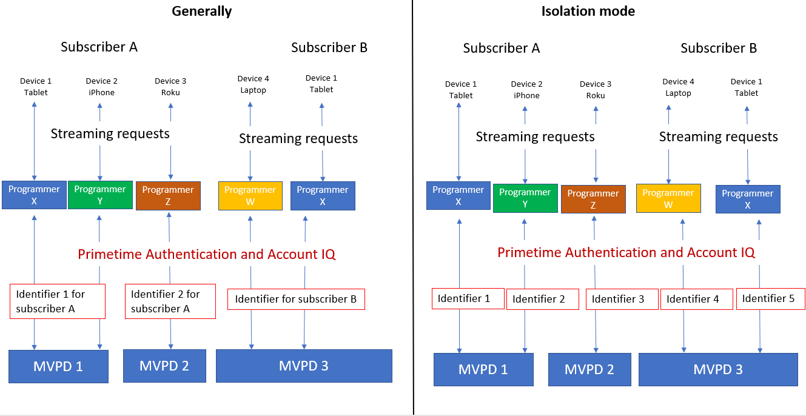

# View sharing reports in isolation mode {#report-isolation-mode}

Generally, Adobe Account IQ evaluates the various streaming events to identify the sharing probablities of subscribers based on the same account identifier for each subscriber play request irrespective of the devices they use. However, some MVPDs (such as Xfinity) identify the play requests (made on different channel apps) by the same subscriber using different devices as separate. Such streaming requests are analysed in Isolation Mode.

In Isolation Mode all the computations made for obtaining the Sharing Scores and all the associated metrics are made using only the activity of the devices streaming from applications belonging to the selected Programmer and channels.

The sharing scores and probabilities are calculated only using the stream that starts from the currently selected channels.

To view metrics in isolattion mode:

1. Select **isolation mode** from the **MVPDs in segment** drop-down option, and select **Apply Selection**.

   

2. Select the desired channels from the **Channels in segment** drop-down option, and select **Apply Selection**. Also, select a [time frame](/help/AccountIQ/product-concepts.md#granularity-def).

>[!Limitation]
>
>Because account sharing is more relevant when measured for streaming across all Programmers’ apps, you will see lower Sharing Scores and some variation in the metrics when in Isolation Mode.

Note that the above gauges show that only 6% of all the accounts are being shared; and only 8% of the content is being consumed by those 8%. So the channels can compare their scores in Isolation Mode with that across the other MVPDs. Therefore, the information obtained by using Isolation Mode should be interpreted differently from the other data.
