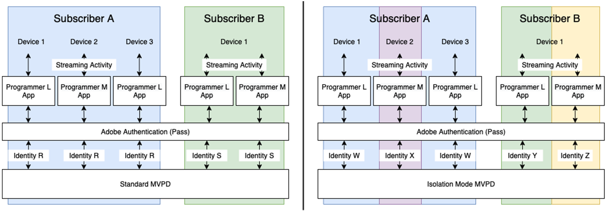
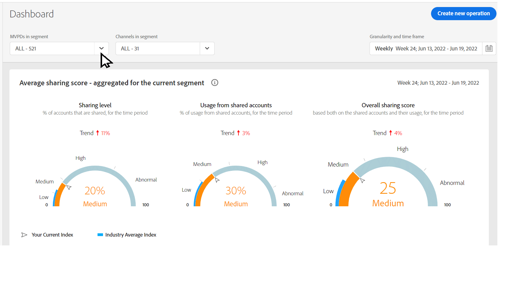
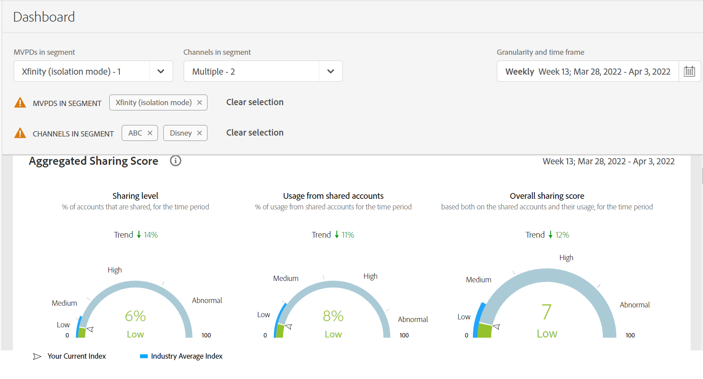

# View sharing reports in isolation mode {#report-isolation-mode}

In Isolation Mode, MVPDs (such as, Xfinity) consistently identify subscribers across devices, but identify their subscribers differently, based on the programmers they interact with. Whereas in the standard mode, MVPDs consistently identify subscribers across devices, irrespective of the programmers.

For example, in the following image if a Subscriber B of an Isolation Mode MVPD (such as, Xfinity) accesses the content offered by two different programmers using the same device, then the MVPD will associate different identifiers with the two different access attempts. So, to those programmers (L and M in the figure) and to Account IQ, it appears that there are two different subscribers accessing the content. However, for Standard MVPD, if Subscriber B accesses content offered by two different programmers, then the MVPD will associate a single access identifier for both access attempts. MVPDs (such as, Xfinity) in Isolation Mode do not consistently identify a subscriber even if the subscriber is using same device across different programmers.

*Figure: Isolation Mode MVPD identifies four different subscribers instead of two*

To manage the distortion of data (due to identifying the same subscriber as different based on accessing different programmers), Isolation Mode limits the activity reported about a programmer to the activity only on that programmer’s applications. For example, for Isolation Mode in the above image, Programmer L sees data based only on the activity of Identities W and Y, ignoring Identities X and Z.

>[!IMPORTANT]
>
> The downside is that Programmer L is deprived of sharing information gathered about Subscribers A and B due to activity with any Programmer other than L.

In Isolation Mode all the computations made for obtaining the Sharing Scores and all the associated metrics are made using only the activity of the devices streaming from applications belonging to the selected Programmer and channels.
The sharing scores and probabilities are calculated only using the stream that starts from the currently selected channels.

To view metrics in isolation mode:

1. Select **isolation mode** from the **MVPDs in segment** drop-down option, and select **Apply Selection**.

   

   *Figure: MVPD selection in Isolation mode*

1. Select the desired channels from the **Channels in segment** drop-down option, and select **Apply Selection**. Also, select a [time frame](/help/AccountIQ/product-concepts.md#granularity-def).

   >[!IMPORTANT]
   >
   >Because account sharing is more relevant when measured for streaming across all Programmers’ applications, you will see lower Sharing Scores and some variation in the metrics when in Isolation Mode.

   

   *Figure: Sharing probability gauges in Isolation mode*

   Note that the above gauges show that only 6% of all the accounts are being shared; and only 8% of the content is being consumed by those 8%. So the channels can compare their scores in Isolation Mode with that across the other MVPDs. Therefore, the information obtained by using Isolation Mode should be interpreted differently from the other data.
