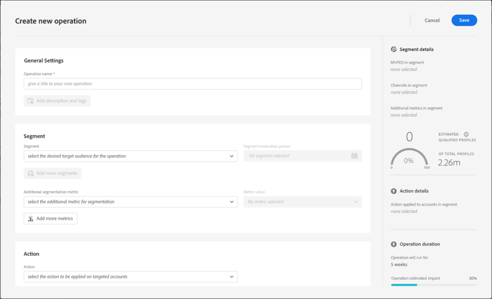
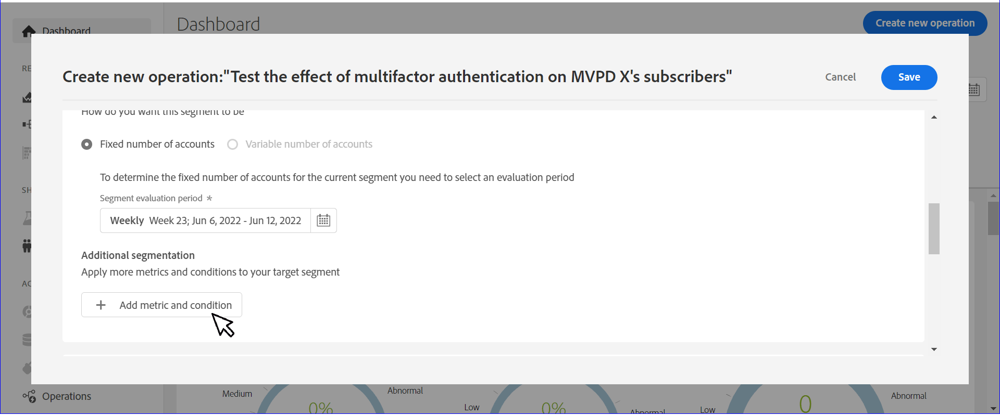
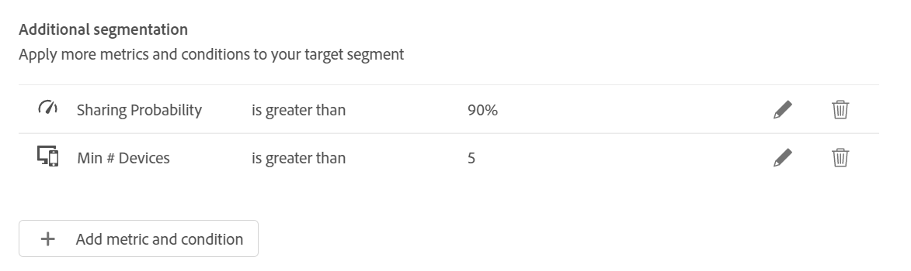
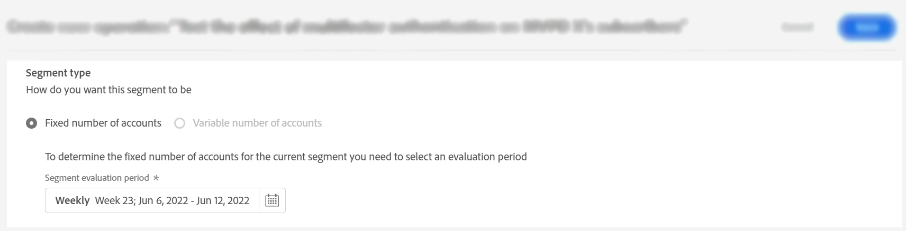
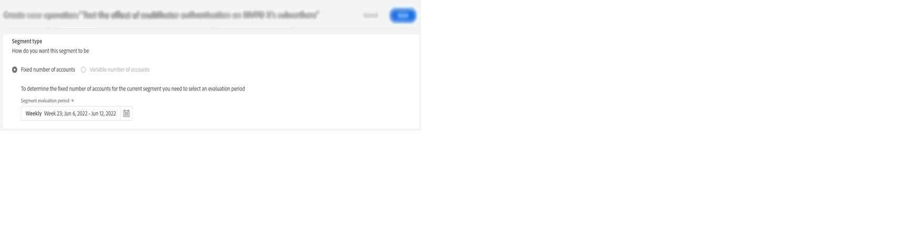
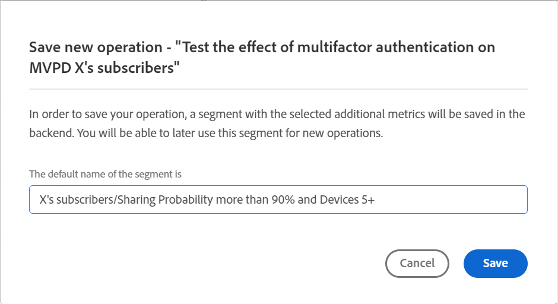
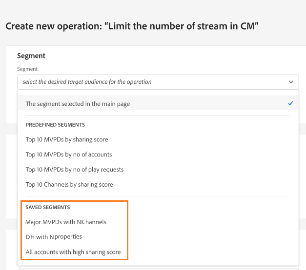
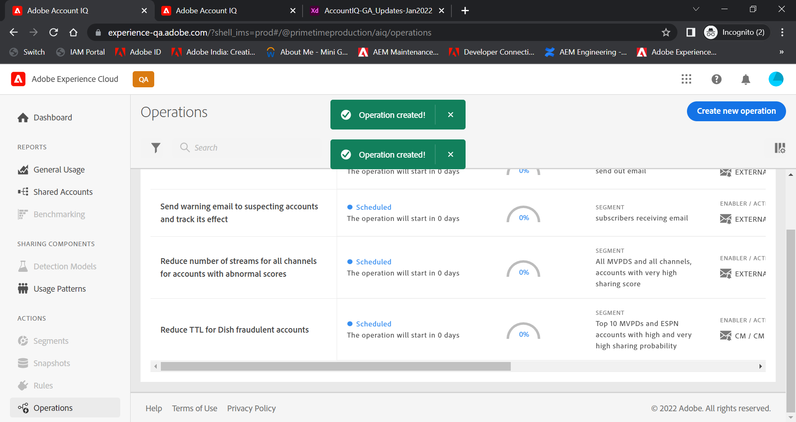

# Create an operation on a user segment {#operation-to-track-segment}

Each reports page on Account IQ has a **Create new operation** option to help you create workflows to automate (and simplify) various (bulk) actions on subscriber accounts; define rules to specify a sample, define actions, and record and analyze the effects of those actions. On the page to create operations, you can define the sample of user groups on which operations will be performed, and schedule the operation to run on a future date.

To create an operation:

1. Define your segment (cohort) for analysis on any of the reports or dashboards page, using the steps in [Defining segments and timeframe](/help/AccountIQ/howto-select-segment-timeframe.md).

1. Select **Create new operation** option available on any of the reports or dashboards pages. The **Create new operation** page is displayed.

    
    *Figure: Page to create new operation*

1. On the **Create new operation** page, fill in the details in the form fields for:
  
   * [Operation name](#operation-details) in Operation details
   * Segment to run the operation on under [Target segment](#segment) and refine the segment using [Additional segmentation](#additional-segmentation)
   * [Segment type](#segment-type) under [Target segment](#segment)
   * [Action](#action)
   * [Schedule activation](#schedule)

1. [Save the operation](#save-operation).

## Operation details {#operation-details}

Name the new operation in **Operation name** field under Operation details. For example, "*Test the effect of multifactor authentication on MVPD X's subscribers" or "Limit the number of streams in Concurrency Monitoring" or "Limit MVPD D's subscribers viewing channel 'N' from 20 plus devices*".

## Target segment {#segment}

The **Segment** here defines the users who will be operated on by this operation; or the sample group for your operation. The default segment is the **segment** you selected using [segment and timeframe panel](/help/AccountIQ/howto-select-segment-timeframe.md) on main reports or dashboards page in step 1 above.

<!--* The first segment entry in the **Segment** section, by default, shows the **segment** you selected in the step 1.

* The **segment evaluation period** is the time period of analysis you selected in step 1 from **Granularity and Timeframe** option.

*Figure: Segment and timeframe selection on the main page*-->

This segment defines the subscribers of the MVPDs and Channels that will be impacted by the operation being created. For example, your (default) segment includes *all the subscriber accounts of MVPD named 'C' who view the channel 'N Sports'*.

### Additional segmentation {#additional-segmentation}

Additionally, you can refine your target segment by adding more metrics. For example, you can add Sharing Probability that is greater than 90% as another metric. So, now the problem statement reads *"create an operation for subscriber accounts of MVPD named 'C' who are viewing the channel 'N Sports' that have a sharing probability greater 90%"*.

*Figure: Additional segmentation*

Further, if you refine the operation by adding another metric for number of devices, then the updated problem statement reads *"create an operation for subscriber accounts of MVPD named 'C' who are viewing the channel 'N Sports' that have a sharing score above 90 and are using more than 5 devices to view content during the evaluation period"*.

*Figure: Refined example segment with overall sharing score and number of devices metrics*

By doing this, the user group becomes more refined. So, by adding more metrics and conditions, you are further qualifying the segment to define the accounts to operate on.

### Segment type {#segment-type}

Segment Type is the way in which a segment is treated throughout the operation's evaluation period.

*Figure: Refine the number of segments to operate on using Segment type*

<!--The segment type option allows you to further refine your segment based on the evaluation period (or time).

**Fixed number of accounts** 

When you select **Fixed number of accounts** segment type, then you need to specify an evaluation period as well.

By doing so, you are fixing the sample size for evaluation in terms of numbers. You are making Account IQ identify a specific set of users (that meet the criteria of defined evaluation period and segment metrics) to operate on. The analysis and graphs will be generated for this specific set of users only (identified initially) throughout the operation.

**Variable number of accounts**

When you select **Variable number of accounts** segment type, you do not limit the number of accounts in segment. The accounts which fall under the defined segment metrics are the part of the segment, and the number of accounts will change continuously during the course of operation.-->

>[!IMPORTANT]
>
>You can only use **Fixed number of accounts** option, as of now. The option to select **Variable number of accounts** will be available in upcoming releases.

<!--

you tell Account IQ in the beginning of the operation which number of accounts to operate on.

Account IQ system only has a segment definition, and during the operation it looks into all the accounts that fit that segments.

the number of accounts in segment is not limited, the accounts that fall under defined segment metrics will be part of the segment, and the no of accounts will change continuously, as there are no specific limitations - like an evaluation period in the past.When the segment is defined (which in this example is, subscriber accounts of MVPD 'C' who are viewing the channel 'N Sports' that have a sharing score above 80 and are using 10 different IPs) and we also identified a time period to evaluate a segment. This identifies X number of accounts as sample (for example 5000). How many devices they are using?
It identifies x-number of accounts (5000)...a very specific set of users that meet this criteria.
for every period that we schedule (within that operation) during that operation) we will look at those 5K users that are originally identified and we will present graph about them. How are the sharing scores coming up?u We identified a period. Are their sharing scores going up? Are there fewer of them who are meeting this definition?
Fixed versus variable is the way the treated in fixed or variable way.

1. we identified a fixed set of accounts.
2. we evaluate those specific accounts on criteria throughout the operation.

General idea independent of graph is that we will evaluate a set of accounts identified initially, for no of periods during operation and generate graphs against that.
Those are the 5000 users for which I will create graphs for for every period of the operation.

**Variable number of accounts**
We do not identify any initial set of accounts, we just have a segment definition.
Each period during the operation, we go and look into all the accounts that fit that segments.
If it is not a fixed segment, I won't initially evaluate it. I won't have an initial set of 5000. Instead at every period during the evaluation I will evaluate the segment then, and then I will produce graph about the next 3000 users.
the......will vary from period to period.

if not fixed segment, then I won't initially evaluate or have initial set of 5000, instead at every period during an operation and the.-->

## Action {#action}

The **Action** defines what operation you will perform on the defined segment.

There are two types of actions you can take:

* Actions using systems integrated with Account IQ; such as [Concurrency Monitoring](https://tve.helpdocsonline.com/concurrency-monitoring-introduction)<!--, or Adobe Target-->.

* Actions to create and process workflows that are external to Account IQ and not integrated with Account IQ system. For example, an action for channel programmer 'N' to send bulk emails to all the subscribers of MVPD 'C'.

>[!NOTE]
>
>By creating operations, you not only specify actions and define their scope, but also begin to record the effect of these operations.

## Schedule{#schedule}

You can schedule the activation for the operation by setting start and end dates.

>[!NOTE]
>
>The start date and end date have a granularity same as the granularity you selected for the evaluation when defining segment using **segment and timeframe panel**, in step 1.
>
>
>So if you selected the granularity as Week then the start and end dates are in terms of week (for example Week 14); if you select granularity as Month, then the start and end dates are in terms of months.

>[!IMPORTANT]
>
>The Start date must be later than the evaluation period and also later than the current date. Similarly, the end date must also be later than the Start date and the current date.

### Save the operation {#save-operation}

When you save the operation, a message screen is displayed that informs you that the segment you defined in this operation is saved also for future. However, you need to name this segment.

*Figure: Save operation and specify segment name*

>[!NOTE]
>
>It is a best practice to name your operation based on the action you are taking in combination with the segment you will act on.

<!--In future you can select this saved segment when defining a segment for your analysis on the main reports page. Moreover, the saved segment is also listed when you create an operation the next time.

*Figure: Saved segments in segment selector on Create new operations page* 

>[!IMPORTANT]
>
>When creating an operation, if you select a segment that was previously created then you cannot add new metrics to it and refine it.
>
>Adding new metrics creates a new segment, but you cannot modify an existing segment.-->

Once you have created an operation, it will run from the start date till the end date that you have specified.

The details of your saved operation can be seen on the main [Operations](/help/AccountIQ/operations.md) page.

*Figure: Newly created operation gets listed on the main Operations page*
