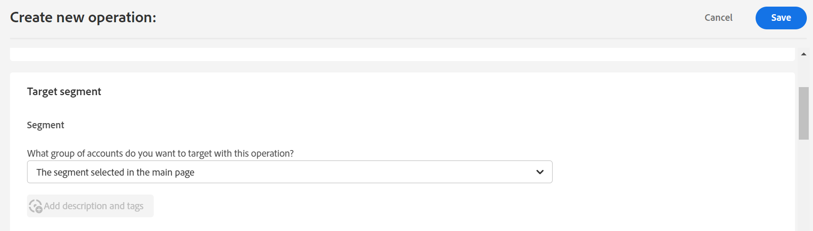

# How to create operation to track a user segment? {#operation-to-track-segment}

Each reports page on Account IQ has a **Create new operation** option to help you create certain workflows, define the sample of user groups on which they will act, and schedule their activation to a later date.

The **create new operations** page helps you automate certain actions you want to perform on a user group and analyze the effects of those actions.

To create an operation:

1. Identify/define your segment(cohort) for analysis.

    1. Select the desired MVPD(s).
    2. Select the desired programmer Channel(s).
    3. Specify a time period from the **Granularity and Timeframe** option.

1. Select **Create new operation**. The **Create new operation** page is displayed.

    

1. On the **Create new operation** page, fill in the details in the form fields:

    * **General Settings**

        Name the new operation in **operation name** field. For example: "Test the effect of multifactor authentication on MVPD X's subscribers" or "Limit the number of streams in Concurrency Monitoring".

    * **Segment**

        The **segment** here defines the users who will be operated on by this operation; or the sample group for your operation.
        * The first segment entry in the **Segment** section, by default, shows the **segment** you selected in the step 1. This segment defines the subscribers of the MVPDs and Channels that will be affected by the operation being created.
        * The **segment evaluation period** is the time period of analysis you selected in step 1 from **Granularity and Timeframe** option.

          

        For an example, your (default) segment (selected on the main dashboard or reports page) includes all the subscriber accounts of MVPD named 'C' who view the channel 'N Sports'.

        

        Additionally, You can refine your default segment by adding more metrics. For example, you if want to add Sharing Score that is above 80 as another metric.

        So, now the problem statement reads *"create an operation for subscriber accounts of MVPD named 'C' who are viewing the channel 'N Sports' that have a sharing score above 80"*.

        Further, if you refine the operation by adding another metric for number of IPs. Then the updated problem statement reads *"create an operation for subscriber accounts of MVPD named 'C' who are viewing the channel 'N Sports' that have a sharing score above 80 and are using 10 different IPs during the evaluation period to view content"*.

        By doing this, the user group becomes even small. So, on adding more **description and tags**, you are additionally qualifying the segment to define your sample to operate on.

    * **Action**

        The **Action** defines what operations you can perform on the defined segment.

        There are two types of actions you can take:

        * Actions using systems integrated with Account IQ; such as [Concurrency Monitoring](https://tve.helpdocsonline.com/concurrency-monitoring-introduction), or Adobe Target.

        * Actions to create and process external workflows; such as channel programmer 'N' sending bulk emails to all the users/subscribers/viewers of MVPD 'C'.

     >[!NOTE]
     >
     >By creating operations, you not only created and defined the scope of actions but also agreed to track the effect of these operations.

    * **Schedule**

        You can schedule the activation time for the particular operation by setting their start and end date and time.

        >[!NOTE]
        >
        >Duration of the time you set (using start and end dates) for activating an operation, it should be equal to the granularity you select.