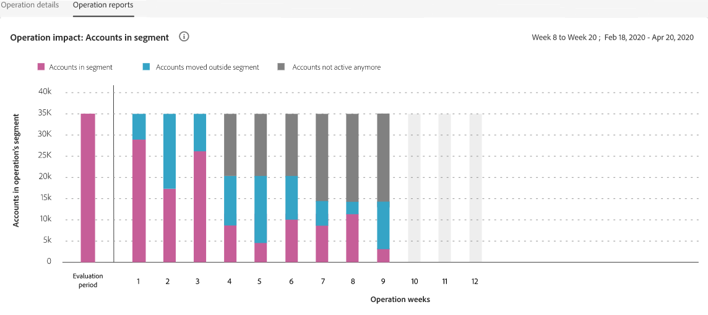
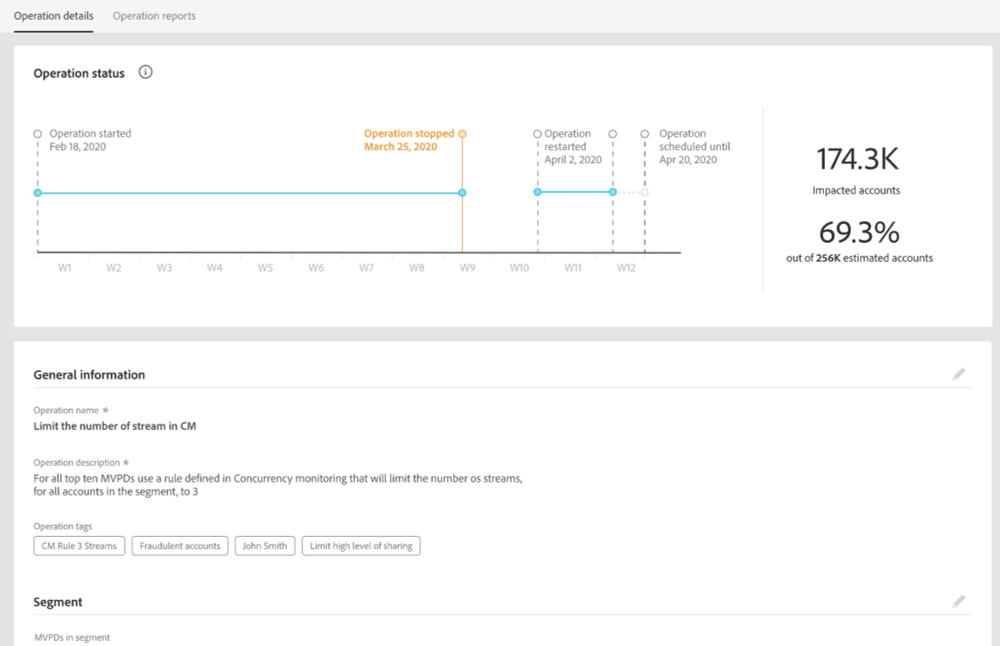
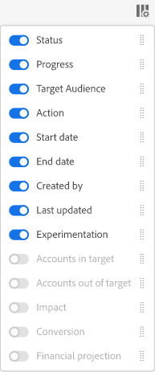

# Operations {#operations-tab-next-steps}

Once you have understood your subscribers' usage patterns and identified password sharing for selected segment (using reports and analytics in Account IQ), you can take targeted actions towards an objective to mitigate password sharing.

The Operations functionality in Account IQ help you effectively tackle and manage credential sharing through focused procedures called operations. It gives you options to design an objective, tailor targeted actions (based on the objective) for a specific groups of subscriber accounts, and automate their execution for a future duration. Through Operations functionality, you can not only create and execute operations, but also gauge their impacts. So, by gauging the impacts you can adjust your strategy to optimize the effect, whether converting borrowers or mitigating credential sharing.

To view **Operations** page select **Operations** option under **Actions** in left navigation of Account IQ application. The Operations page lists all the operations already existing on the Account IQ system along with their details.

*Figure: List and details of existing operations in Account IQ*

On the Operations page, you can:

* View a list of operations already existing in the Account IQ

* View operation details, such as:

  * status (Scheduled, Running, Ended, Error, or Stopped)

  * progress (in percentage completion)
  
  * target audience (segment to run the operation on)

  * schedule (beginning and end date of operation)

  * creation and end date of the operation

* [Create new operation](/help/AccountIQ/operation-affecting-user-segment.md)

* [View operation reports](#operation-reports)

<!--* Search from the list of operations using Search field

* Stop an operation.

* Create a duplicate operation.

* [Configure columns of Operations details page](#configure-columns)-->

## View operation reports {#operation-reports}

When you select an operation, its details are displayed along with the status.

There is also an option to view the impacts of these operations by using **Operation reports** option.

*Figure: Operations reports to view the impacts of the operations*

<!--

*Figure: Operation details*
## Configure columns {#configure-columns}

You can select the icon to **Configure columns** on the top of the operations table.

*Figure: Configure columns of Operations details page*-->