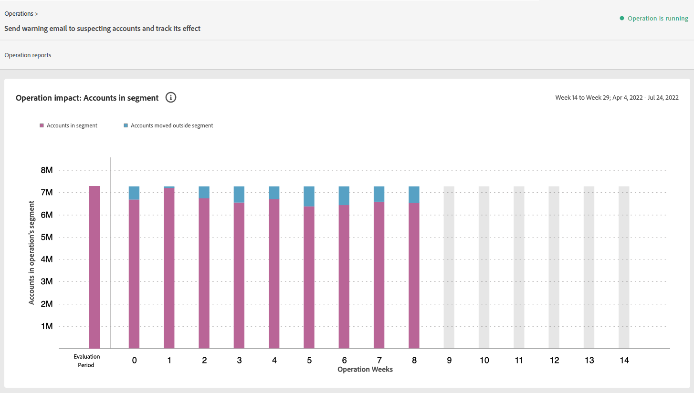

# Operations {#operations-tab-next-steps}

Once you have understood your subscribers' usage patterns and identified password sharing for selected segment (using reports and analytics in Account IQ), you can take targeted actions towards an objective to mitigate password sharing.

The Operations functionality in Account IQ help you effectively tackle and manage credential sharing through focused procedures called operations. It gives you options to design an objective, tailor targeted actions (based on the objective) for a specific groups of subscriber accounts, and automate their execution for a future duration. Through Operations functionality, you can not only create and execute operations, but also gauge their impacts. So, by gauging the impacts you can adjust your strategy to optimize the effect, whether converting borrowers or mitigating credential sharing.

To view **Operations** page select **Operations** option under **Actions** in left navigation of Account IQ application. The Operations page lists all the operations already existing on the Account IQ system along with their details.

*Figure: List and details of existing operations in Account IQ*

On the Operations page, you can:

* View a list of operations already existing in the Account IQ

* View operation details, such as:

  * status (Scheduled, Running, Ended, Error, or Stopped)

  * progress (in percentage completion)
  
  * target audience (segment to run the operation on)

  * schedule (beginning and end date of operation)

  * creation and end date of the operation

* [Create new operation](/help/AccountIQ/operation-affecting-user-segment.md)

* [View operation reports](#operation-reports)

<!--* Search from the list of operations using Search field

* Stop an operation.

* Create a duplicate operation.

* [Configure columns of Operations details page](#configure-columns)-->

## View operation reports {#operation-reports}

You can analyze the impacts of an operation by viewing its report. To view an operation's report:

1. Select the operation name on main Operations page.

   Report is displayed in the form of a stacked bar graph.

   

   *Figure: Operations report to view the impacts of the operations*

   The x-axis plots the evaluation period and y-axis plots a variable to gauge the impact of operation.

   For example, in the above image the variable on the y-axis is number of accounts. Looking at the graph you can compare the number of accounts those are in the operations segment versus the number of accounts that are outside the operations segment at a particular time (such as week 2nd of the operations evaluation period). Therefore, you can analyze how over the evaluation period does number of accounts vary within the operation segment and outside the segment.

   So, if your operation was to send out warning emails to suspecting accounts, and accounts in operations segment were those with sharing probability more than 90 and using more than 5 devices to stream content, then in the beginning of the evaluation period accounts in segment are more than 7 million. This number changes over the evaluation period as shown in the graph, thereby indicating the impact of operation. Based on the evaluation, you can take remedial measures on suspecting accounts, or continue with the operation, or adjust your strategy for better outcomes to curb credential sharing.

2. To close the report and go back to the main Operations page, select **Operations** option under **Actions** in left navigation.

<!--

*Figure: Operation details*
## Configure columns {#configure-columns}

You can select the icon to **Configure columns** on the top of the operations table.

*Figure: Configure columns of Operations details page*-->