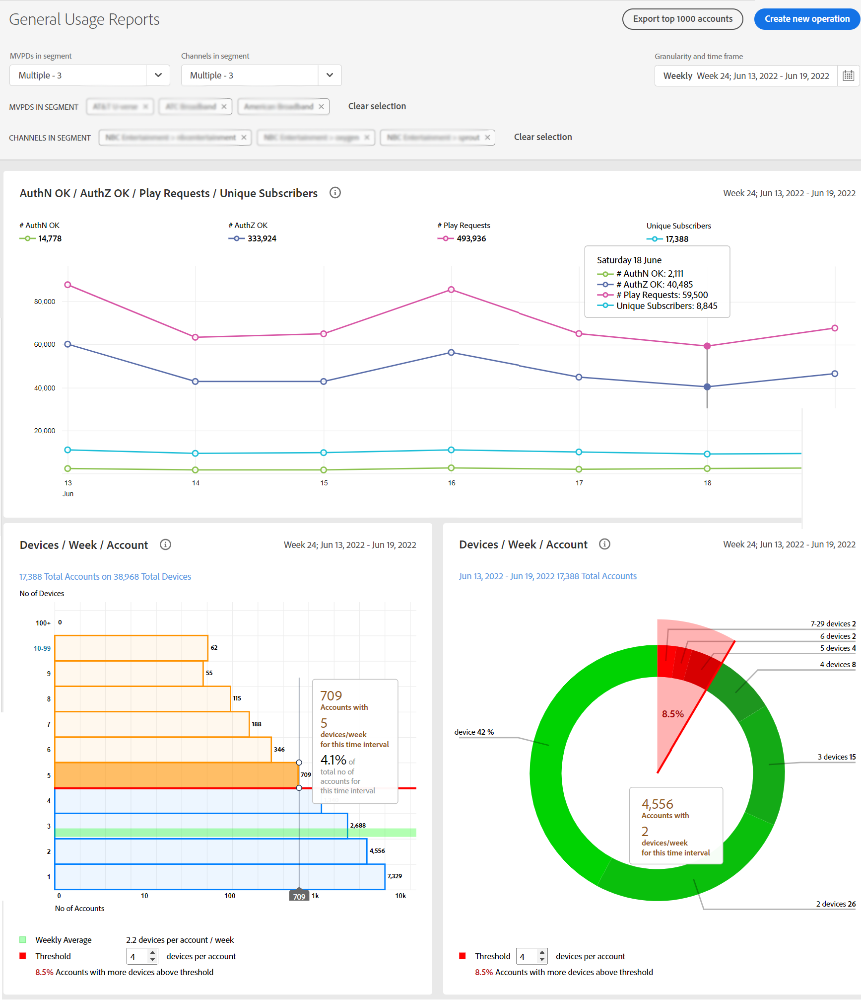
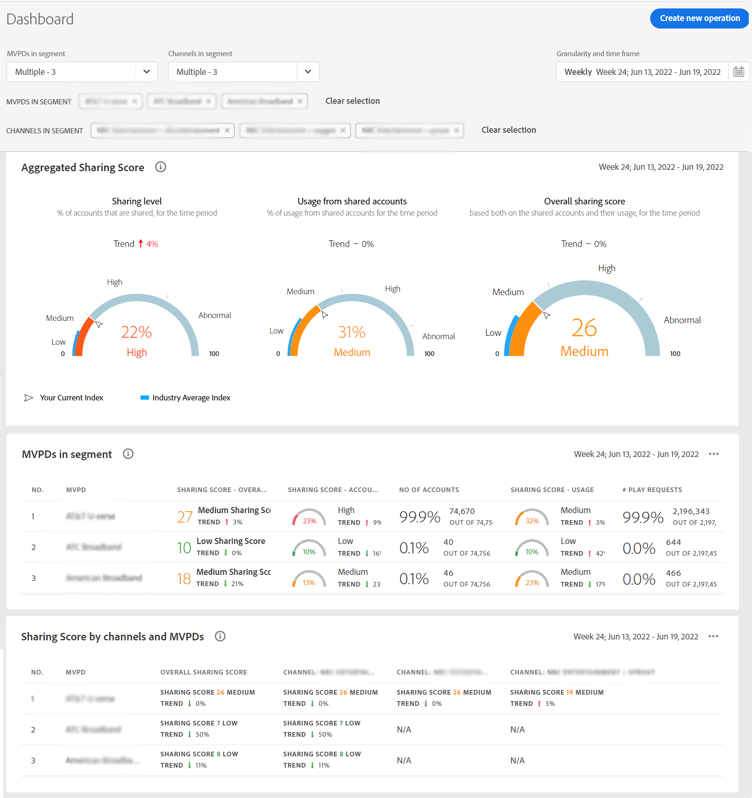
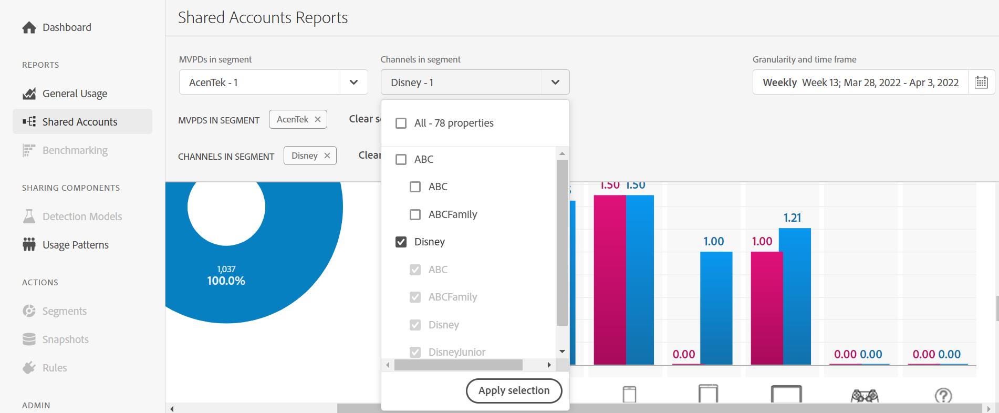
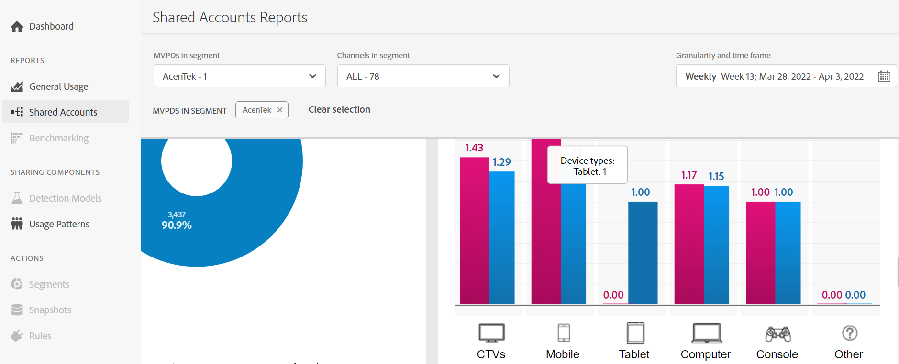

# View account sharing reports: for a specific MVPD <!--and programmer--> {#report-sp-mvpd}

If you are logged in to Account IQ application as a channel [programmer](/help/AccountIQ/product-concepts.md#programmer-def), then you can view sharing reports of your channel viewers for the specific [MVPD](/help/AccountIQ/product-concepts.md#mvpd-def) they have subscribed to.

To view reports in Account IQ, once you have successfully logged in to the application as a programmer:

1. Define your subscriber segment for analysis and viewing reports using steps in [How to define segment](/help/AccountIQ/howto-select-segment-timeframe.md).

   >[!NOTE]
   >
   >You can select one, two, or multiple MVPDs, or even default selection of top 10 MVPDs (by sharing score, usage, or accounts).
   >
   >However, you can select [at most 10 MVPDs](/help/AccountIQ/limitations.md) from the MVPD selector in the [segment and time frame panel](/help/AccountIQ/segments-timeframe.md).

1. Select a desired reports page from the left navigation:

* [General Usage](/help/AccountIQ/general-usage-reports.md)

  
* [Shared Accounts](/help/AccountIQ/shared-acc-reports.md)
* [Usage Patterns](/help/AccountIQ/usage-patterns.md)
* [Dashboard](/help/AccountIQ/dashboard.md) (dashboard gives a glimpse of the selected graphs from different reports pages).

  
<!--## If you are logged in as an MVPD {#report-sp-programmer}

To view reports in Account IQ, once you have successfully logged in to the application as an MVPD:

1. Select the desired programmer channel(s) from from the **Channels in segment** drop-down option.

   

 1. From the **Granularity and time frame** option, select the time interval to view reports. You can aggregate the time intervals week-wise or month-wise.

1. Select a desired reports page from the left navigation-[General Usage](/help/AccountIQ/general-usage-reports.md), [Shared Accounts](/help/AccountIQ/shared-acc-reports.md), [Usage Patterns](/help/AccountIQ/usage-patterns.md), or even [Dashboard](/help/AccountIQ/dashboard.md) (dashboard gives a glimpse of the selected graphs from different reports pages).

-->