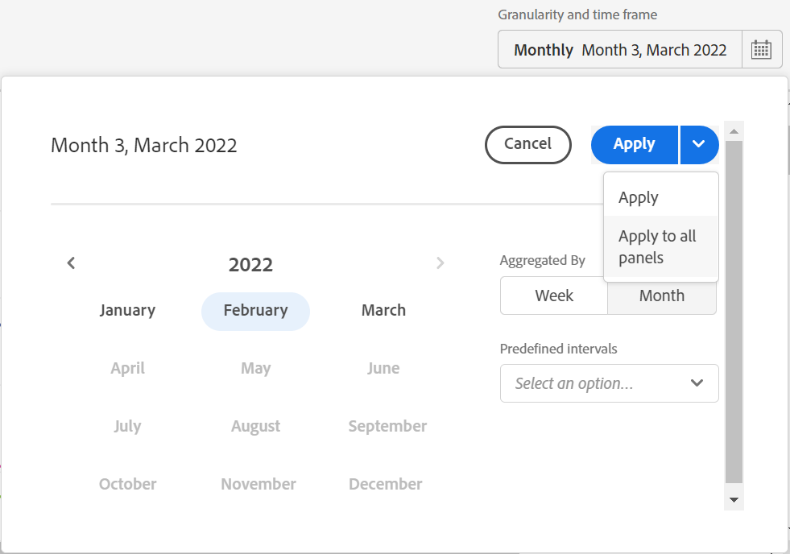
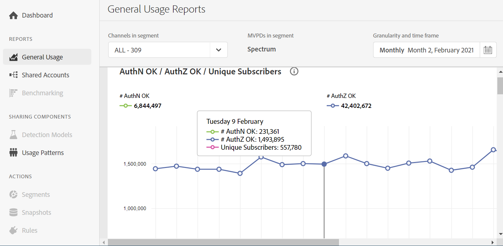

# View account sharing reports: for a specific MVPD <!--and programmer--> {#report-sp-mvpd}

If you are a [programmer](/help/AccountIQ/product-concepts.md#programmer-def), you can view sharing reports of your channel viewers for the specific [MVPD](/help/AccountIQ/product-concepts.md#mvpd-def) they have subscribed to.

To view reports in Account IQ, once you have successfully logged in to the application as a programmer:

1. Go to segment panel at the top of the application.

   1. From the **MVPDs in segment** option, deselect **All**. Doing this enables the selection of individual MVPDs.

      >[!NOTE]
      >
      >By default, all the MVPDs (that aggregate your channels) are selected.

   1. In the **Channels in segment** drop-down, deselect **All** to enable the selection for individual programmers and channels.

      >[!NOTE]
      >
      >The top level checkboxes are programmers and the next level checkboxes are their channels.

    1. From the **Granularity and time frame** option, select the time interval to view reports. You can aggregate the time intervals week-wise or month-wise.

       

1. Select a desired reports page from the left navigation-[General Usage](/help/AccountIQ/general-usage-reports.md), [Shared Accounts](/help/AccountIQ/shared-acc-reports.md), [Usage Patterns](/help/AccountIQ/usage-patterns.md), or even [Dashboard](help/AccountIQ/dashboard.md) (dashboard gives a glimpse of the selected graphs from different reports pages).

   

## If you are logged in as an MVPD {#report-sp-programmer}

To view reports in Account IQ, once you have successfully logged in to the application as an MVPD:

1. Select the desired programmer channel(s) from from the **Channels in segment** drop-down option.

   

 1. From the **Granularity and time frame** option, select the time interval to view reports. You can aggregate the time intervals week-wise or month-wise.

1. Select a desired reports page from the left navigation-[General Usage](/help/AccountIQ/general-usage-reports.md), [Shared Accounts](/help/AccountIQ/shared-acc-reports.md), [Usage Patterns](/help/AccountIQ/usage-patterns.md), or even [Dashboard](help/AccountIQ/dashboard.md) (dashboard gives a glimpse of the selected graphs from different reports pages).

