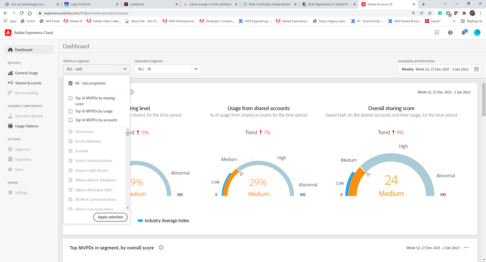

# Cohorts and subscriber segments {#cohorts-segments}

When you log into Account IQ, there is a panel at the top that lets you define the subscriber [segment](/help/AccountIQ/product-concepts.md#segment-segmet-def) to filter your results for viewing reports for subscriber sharing behavior and patterns.

The following dropdown options are used to define segments:

* **MVPDs in segment**

  The **MVPDs in segment** selector lets you choose the [MVPDs](/help/AccountIQ/product-concepts.md#mvpd-def) (individuals or group) for whose subscriber you want to view the account sharing reports.

  In this selector, apart from selecting the individual MVPDs you can also select the following groups:
  * [Top 10 MVPDs by sharing score](/help/AccountIQ/product-concepts.md#top-mvpds-def)
  * [Top 10 MVPDs by usage](/help/AccountIQ/product-concepts.md#top-mvpds-def)
  * [Top 10 MVPDs by accounts](/help/AccountIQ/product-concepts.md#top-mvpds-def)
  * [Isolation mode](/help/AccountIQ/isolation-mode.md)

* **Channels in segment**

  The **Channels in segment** selector lets you further narrow down your filter to select channels corresponding to the selected MVPDs.

  <!--For example, you can define your segment as the "subscribers of the MVPD A that watched the channels X, Y, and Z".-->

* **Granularity and time frame**
  
  The **Granularity and time frame** selector lets you specify the dates and the duration, or size of time for which you want to view the subscriber sharing behavior.
  
So, with these controls you can define your problem statement as "subscribers of the MVPD A that watched the channels X, Y, and Z in the month of May".
