# Shared Accounts Reports {#shared-accounts-reports}

The Shared Accounts Reports break down the metrics such as number of devices and device types by the selected range of sharing probability, for example **Over Moderate Probability** and **Over Low Probability**. These ranges can then serve as user defined thresholds and the graphs are updated based on the selected thresholds.

Account IQ classifies all the subscriber accounts of the defined segment into the accounts with the following five categories based on their sharing probabilities:

* Very high
* High
* Moderate
* Low
* Very low

Once you define a segment by selecting the desired MVPDs from **MVPDs in segment** option and the programmer channels from the **Channels in segment** option, the following charts are prepared based on the sharing probabilities of accounts.

## Accounts Sharing Probability {#accounts-sharing-probability}

The donut chart here categorizes and shows the percentages (and absolute numbers) of the subscriber accounts from various probability categories.

The red line marks the threshold range selected by users in [Accounts over threshold in current segment](#threshold-selector) panel.

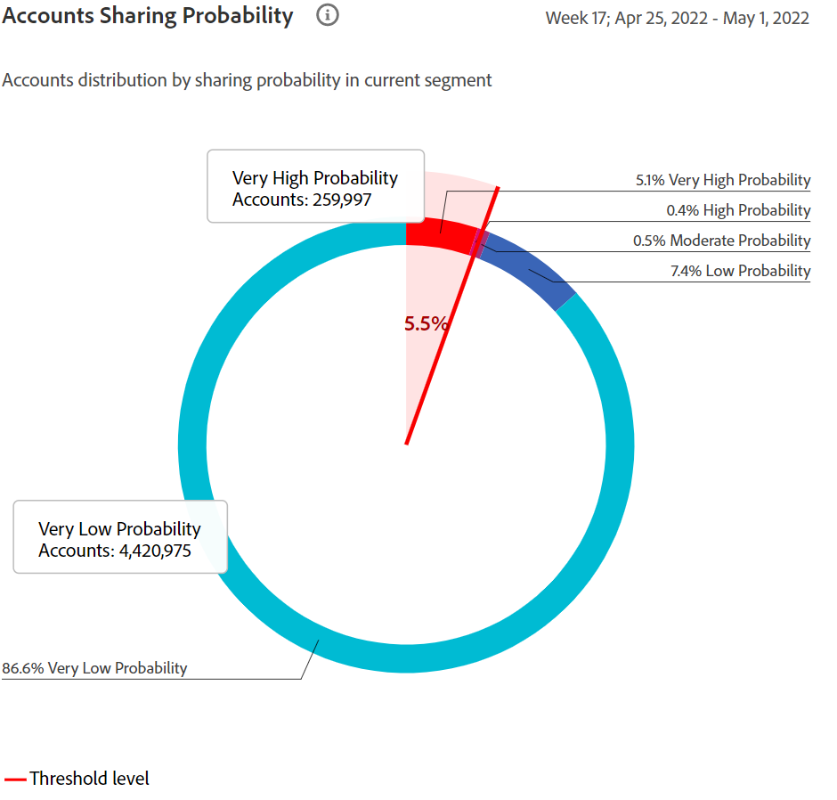

The bar chart plots number of accounts on y-axis for various categories of sharing probabilities (plotted on x-axis).

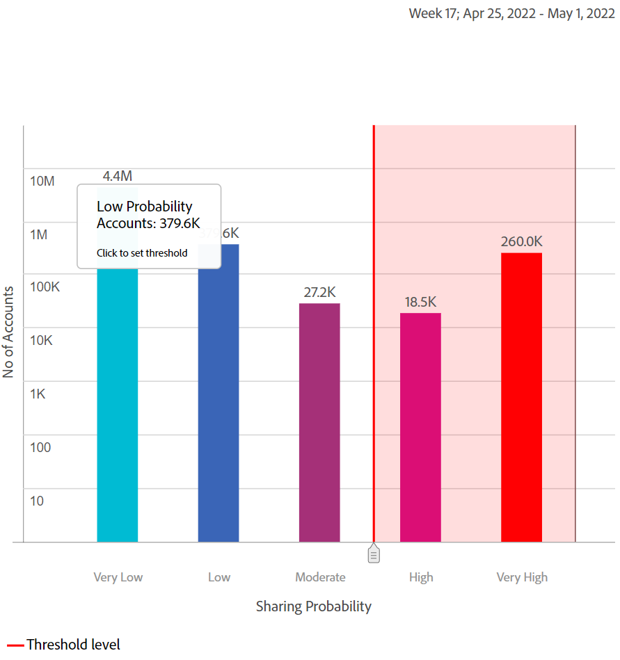

The red line marks the range of threshold, and can be adjusted in the bar chart. The threshold adjusted in the bar chart reflects in the threshold range in donut chart.

<!--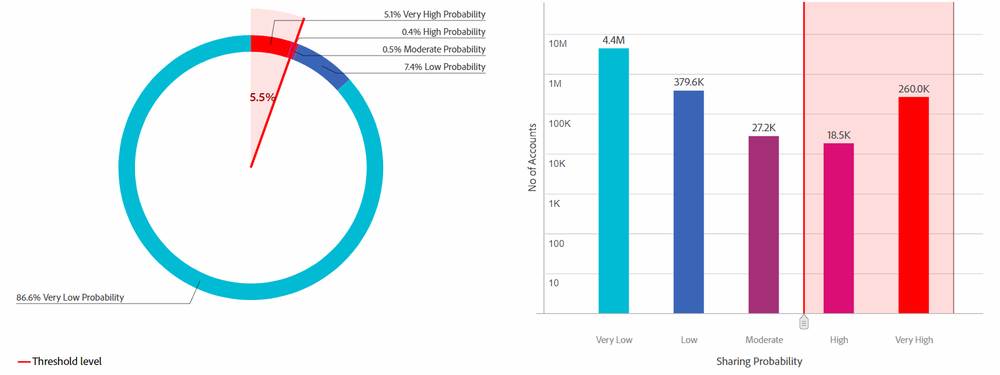-->

### Accounts over threshold in current segment{#threshold-selector}

This panel lets you select a range from the following as threshold for subscriber accounts (based on their haring probabilities):

* Accounts **over very low** sharing **probability**

* Accounts **over low** sharing **probability**

* Accounts **over moderate** sharing **probability**

* Accounts **over high** sharing **probability**

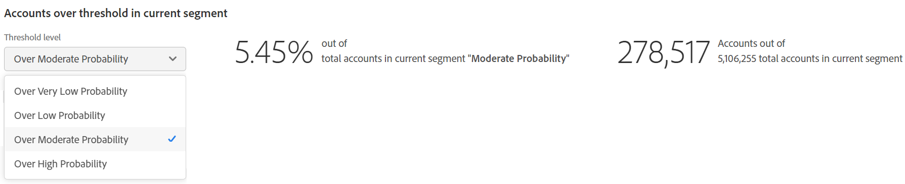

Once you select the threshold, the panel shows the percentage (and number) of accounts out of all the subscriber accounts for the MVPDs selected in the segment.

## Segment - Play requests out of total {#play-request-out-total}

The donut chart shows the percentage (and number) of play requests made by subscribers in the segment; and lets you compare the play requests made by subscribers not in the defined segment.

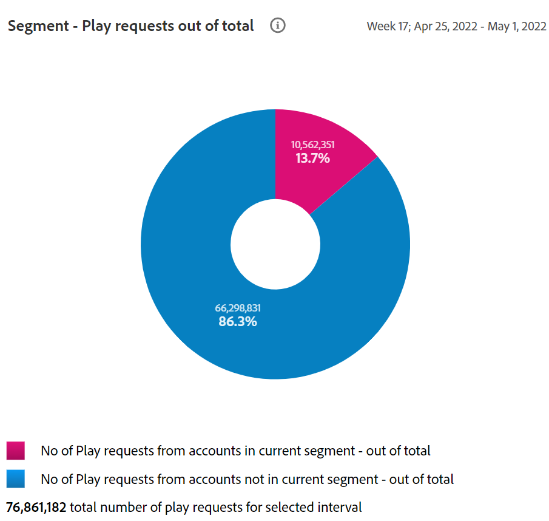

When you move cursor on the donut chart, it also shows subscriber percentages and numbers from various probability ranges.

<!--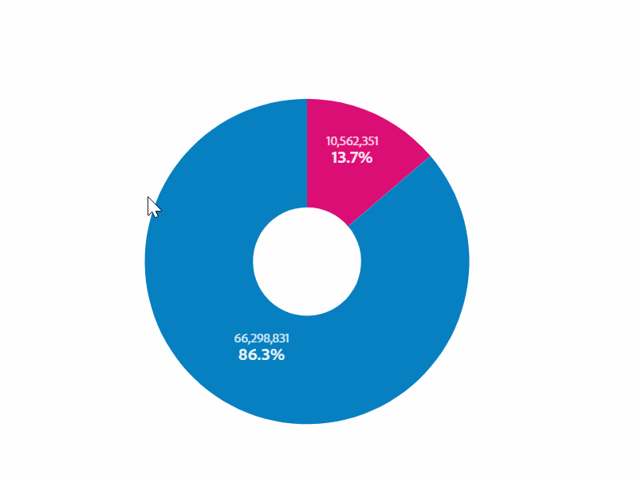-->

## Segment-Average Number of Devices Per Account{#avg-devices-account}

The bar chart shows number of subscribers in the current segment and number of subscribers not in current segment devices-wise

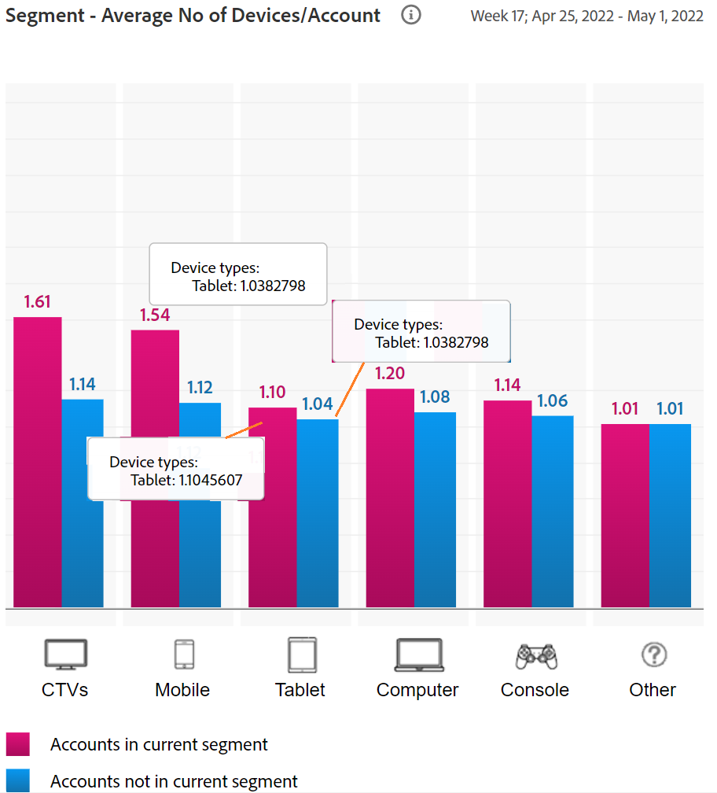

From this metric you can deduce that how many subscribers in and outside the defined segment are using what all devices.

## Segment - Zip codes per Period per Account {#zip-codes-period-account}

This graph informs you about the number of subscribers that are consuming content from different locations in a time frame.

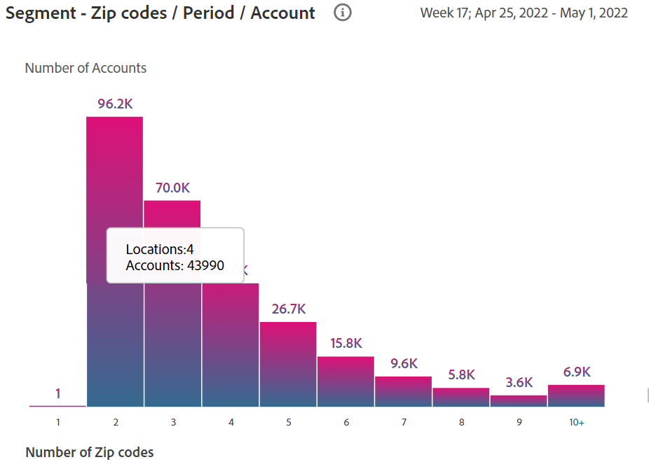

You can zoom in to narrow down and view specifics of a bar in the graph that plots a range of locations.

<!--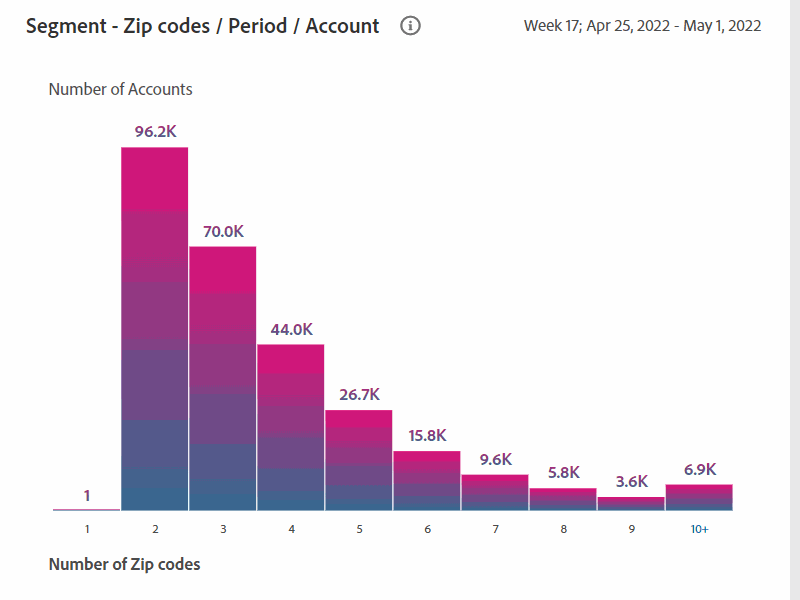-->

## Segment - Geographical Span / Period / Account {#geo-span-period-account}

This bar graph plots number of subscriber accounts with respect to different ranges of geographical ranges in miles. Based on the subscriber locations and their distances (in miles) from each other you can compare how many accounts are within a range of x miles of each other.  

<!--Total number of users ...

How many accounts are within 99 miles of each other.....and how many are apart. 

Based on points on the map.-->

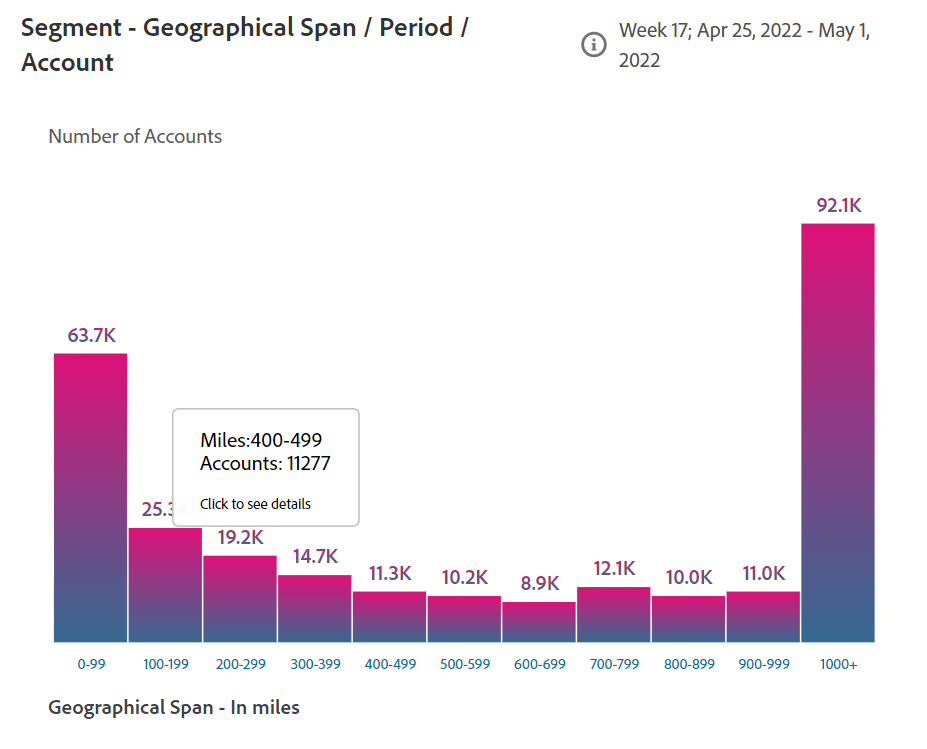

When you select a bar representing a range of geographical distance, it expands the range to show you more details.

<!--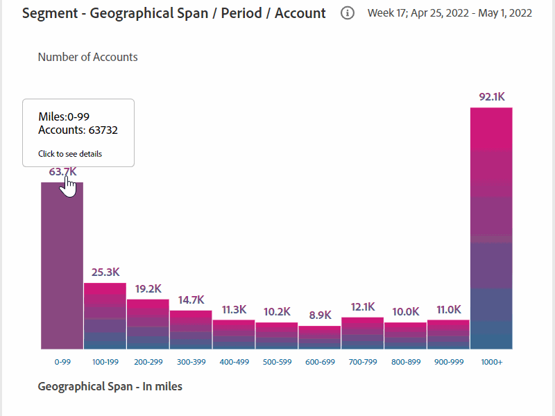-->