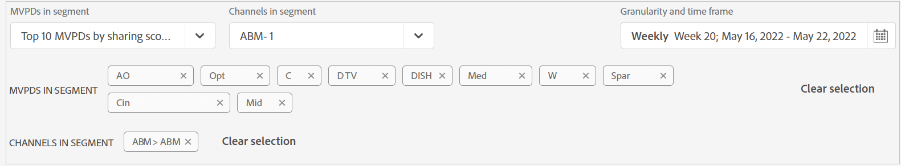

# How to view reports for top 10 MVPDs <!--and Programmers--> {#view-top-10-mvpd-reports}

Account IQ has capabilities to make you view and analyze account sharing statistics for top 10 of your MVPDs (in a defined [segment](/help/AccountIQ/product-concepts.md#segmet-def)) having:

* highest percentage of subscribers that are sharing accounts

* subscribers with maximum usage from shared accounts

* subscribers with highest magnitude (overall sharing score) of password sharing

>[!NOTE]
>
>The basis of calculations, to obtain the list of top MVPDs from a segment, is the data of the entire video streaming industry and not just a specific programmer's MVPD.

>[!NOTE]
>
>Only the MVPDs that have a minimum of 50,000 active subscriber accounts are considered to obtain these reports.

For a logged-in programmer user, following three default selections (to view reports of top ten MVPDs) are available:

* [Top 10 MVPDs by sharing score](#top-10mvpds-sharingscore)

* [Top 10 MVPDs by usage](#top-10mvpds-usage)

* [Top 10 MVPDs by accounts](#top-10mvpds-accounts)

>[!IMPORTANT]
>
>If you select the MVPDs individually to define the segment, then you can select at most 10 MVPDs to view sharing statistics.

## Top 10 MVPDs by sharing score {#top-10mvpds-sharingscore}

When you use the selection **top 10 MVPDs by sharing score** to define your segment, then the Account IQ system identifies 10 MVPDs from across the industry to a list of at most ten MVPDs (along with their corresponding metrics) in the descending order of their [overall sharing score](/help/AccountIQ/product-concepts.md#overall-sharing-score)

To view the list and reports for top ten MVPDs by sharing score for your channel:

1. In the segments panel:

   1. From the **MVPDs in segment** option, select **Top 10 MVPDs by sharing score**, and select **Apply selection**.

   1. From the **Channels in Segment** option, select the desired programmers channels.

      By default **All** are selected. To select a specific channel, deselect **All** and select the desired programmers channels.

      >[!NOTE]
      >
      >In the **Channels in Segment** option, the top level list items are Programmers and the next level list items are channels under them.

   1. Select a time frame from the **Granularity and time frame** option by selecting the calendar picker.

      * Define granularity by using **Aggregated By** option. Either use **Month** or **Week** to define a time frame.

      * Select a timeframe by selecting either a month or a week based on the granularity you have set.

   The names of the MVPDs and Programmer Channels are displayed under the segment selectors. You can use **Clear selection** option to refresh the selection to default.

1. Select a reports page from either of the [General Usage](/help/AccountIQ/general-usage-reports.md), [Shared Accounts](/help/AccountIQ/shared-acc-reports.md), [Usage Patterns](/help/AccountIQ/usage-patterns.md), or even [Dashboard](/help/AccountIQ/dashboard.md) (dashboard gives a glimpse of the selected graphs from different reports pages).

    

## Top 10 MVPDs by usage {#top-10mvpds-usage}

When you use the selection **top 10 MVPDs by usage** to define your segment, then the Account IQ system identifies 10 MVPDs from across the industry to a list of at most ten MVPDs (along with their corresponding metrics) in the descending order of their [usage from shared accounts](/help/AccountIQ/product-concepts.md)

To view the list and reports for top ten MVPDs by sharing score for your channel:

1. In the segments panel:

   1. From the **MVPDs in segment** option, select **Top 10 MVPDs by sharing score**, and select **Apply selection**.

   1. From the **Channels in Segment** option, select the desired programmers channels.

      By default **All** are selected. To select a specific channel, deselect **All** and select the desired programmers channels.

      >[!NOTE]
      >
      >In the **Channels in Segment** option, the top level list items are Programmers and the next level list items are channels under them.

   1. Select a time frame from the **Granularity and time frame** option by selecting the calendar picker.

      * Define granularity by using **Aggregated By** option. Either use **Month** or **Week** to define a time frame.

      * Select a timeframe by selecting a month or a week based on the granularity you have set.

   The names of the MVPDs and Programmer Channels are displayed under the segment selectors. You can use **Clear selection** option to refresh the selection to default.

1. Select a reports page from either of the [General Usage](/help/AccountIQ/general-usage-reports.md), [Shared Accounts](/help/AccountIQ/shared-acc-reports.md), [Usage Patterns](/help/AccountIQ/usage-patterns.md), or even [Dashboard](/help/AccountIQ/dashboard.md) (dashboard gives a glimpse of the selected graphs from different reports pages).

## Top 10 MVPDs by accounts {#top-10mvpds-accounts}

When you use the selection **top 10 MVPDs by sharing accounts** to define your segment, then the Account IQ system identifies 10 MVPDs from across the industry to a list of at most ten MVPDs (along with their corresponding metrics) in the descending order of their [sharing level](/help/AccountIQ/product-concepts.md)

To view the list and reports for top ten MVPDs by number of accounts that are shared for your channel:

1. In the segments panel:

   1. From the **MVPDs in segment** option, select **Top 10 MVPDs by sharing score**, and select **Apply selection**.

   1. From the **Channels in Segment** option, select the desired programmers channels.

      By default **All** are selected. To select a specific channel, deselect **All** and select the desired programmers channels.

      >[!NOTE]
      >
      >In the **Channels in Segment** option, the top level list items are Programmers and the next level list items are channels under them.

   1. Select a time frame from the **Granularity and time frame** option by selecting the calendar picker.

      * Define granularity by using **Aggregated By** option. Either use **Month** or **Week** to define a time frame.

      * Select a timeframe by selecting a month or a week based on the granularity you have set.
    The names of the MVPDs and Programmer Channels are displayed under the segment selectors. You can use **Clear selection** option to refresh the selection to default.

1. Select a reports page from either of the [General Usage](/help/AccountIQ/general-usage-reports.md), [Shared Accounts](/help/AccountIQ/shared-acc-reports.md), [Usage Patterns](/help/AccountIQ/usage-patterns.md), or even [Dashboard](/help/AccountIQ/dashboard.md) (dashboard gives a glimpse of the selected graphs from different reports pages).
