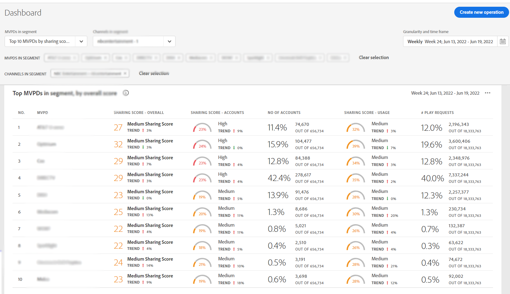

# How to view reports for top 10 MVPDs <!--and Programmers--> {#view-top-10-mvpd-reports}

Account IQ has capabilities to help you view and analyze account sharing statistics for top 10 of your MVPDs (in a defined [segment](/help/AccountIQ/product-concepts.md#segmet-def)) having:

* highest percentage of subscribers that are sharing accounts

* subscribers with maximum usage from shared accounts

* subscribers with highest magnitude (overall sharing score) of password sharing

>[!NOTE]
>
>The basis of calculations, to obtain the list of top MVPDs from a segment, is the data of the entire video streaming industry and not just a specific programmer's MVPD.

>[!NOTE]
>
>Only the MVPDs that have a minimum of 50,000 active subscriber accounts are considered to obtain these reports.

For a logged-in programmer user, following three default selections (to view reports of top ten MVPDs) are available:

* [Top 10 MVPDs by sharing score](#top-10mvpds-sharingscore)

* [Top 10 MVPDs by usage](#top-10mvpds-usage)

* [Top 10 MVPDs by accounts](#top-10mvpds-accounts)

## Top 10 MVPDs by sharing score {#top-10mvpds-sharingscore}

When you use the selection **top 10 MVPDs by sharing score** to define your segment, then the Account IQ system identifies 10 MVPDs from across the industry to list at most ten MVPDs (along with their corresponding metrics) in the descending order of their [overall sharing score](/help/AccountIQ/product-concepts.md#overall-sharing-score)

To view the list and reports for top ten MVPDs by sharing score for your channel:

1. Use the [segment and timeframe panel](/help/AccountIQ/segments-timeframe.md), to define a segment following the steps in [How to define segment and select timeframe](/help/AccountIQ/howto-select-segment-timeframe.md) for evaluation. For this evaluation, select **top 10 MVPDs by sharing score** option from the list of MVPDs.

1. Select a reports page from either of the [General Usage](/help/AccountIQ/general-usage-reports.md), [Shared Accounts](/help/AccountIQ/shared-acc-reports.md), [Usage Patterns](/help/AccountIQ/usage-patterns.md), or [Dashboard](/help/AccountIQ/dashboard.md) (dashboard gives a glimpse of the selected graphs from different reports pages).

Each of these pages will reflect the activity.

## Top 10 MVPDs by usage {#top-10mvpds-usage}

When you use the selection **top 10 MVPDs by usage** to define your segment, then the Account IQ system identifies 10 MVPDs from across the industry to list at most ten MVPDs (along with their corresponding metrics) in the descending order of their [usage from shared accounts](/help/AccountIQ/product-concepts.md)

To view the list and reports for top ten MVPDs by sharing score for your channel:

1. Use the [segment and timeframe panel](/help/AccountIQ/segments-timeframe.md), to define a segment following the steps in [How to define segment and select timeframe](/help/AccountIQ/howto-select-segment-timeframe.md) for evaluation. For this evaluation, select **top 10 MVPDs by usage** option from the list of MVPDs.

1. Select a reports page from either of the [General Usage](/help/AccountIQ/general-usage-reports.md), [Shared Accounts](/help/AccountIQ/shared-acc-reports.md), [Usage Patterns](/help/AccountIQ/usage-patterns.md), or [Dashboard](/help/AccountIQ/dashboard.md) (dashboard gives a glimpse of the selected graphs from different reports pages).

Each of these pages will reflect the activity.

## Top 10 MVPDs by accounts {#top-10mvpds-accounts}

When you use the selection **top 10 MVPDs by accounts** to define your segment, then the Account IQ system identifies 10 MVPDs from across the industry to a list of at most ten MVPDs (along with their corresponding metrics) in the descending order of their [sharing level](/help/AccountIQ/product-concepts.md)

To view the list and reports for top ten MVPDs by number of accounts that are shared for your channel:

1. Use the [segment and timeframe panel](/help/AccountIQ/segments-timeframe.md), to define a segment following the steps in [How to define segment and select timeframe](/help/AccountIQ/howto-select-segment-timeframe.md) for evaluation. For this evaluation, select **top 10 MVPDs by account** option from the list of MVPDs.

1. Select a reports page from either of the [General Usage](/help/AccountIQ/general-usage-reports.md), [Shared Accounts](/help/AccountIQ/shared-acc-reports.md), [Usage Patterns](/help/AccountIQ/usage-patterns.md), or [Dashboard](/help/AccountIQ/dashboard.md) (dashboard gives a glimpse of the selected graphs from different reports pages).

Each of these pages will reflect the activity.
