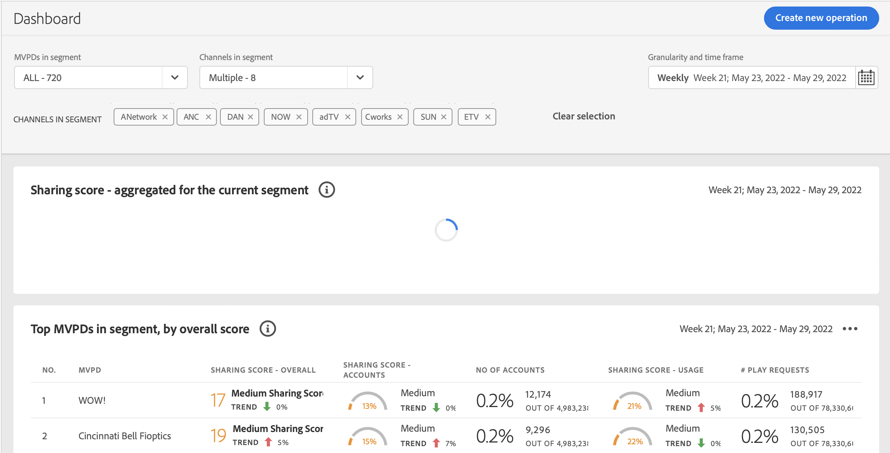

# Troubleshoot issues in Account IQ {#troubleshoot}

Are you facing issues with data and charts taking too long to load, or reports not getting exported, or any other issues related to metrics and graphs? Read on to get quick help.

* If a page or individual panels take too long to load, then try refreshing the page. For the current version, depending on the selection of MVPDs and programmers, a page can take up to a minute to load.

  

* If you are not able to see any data or graph even after refreshing, then log out of Account IQ and then log in again.

* If none of the above troubleshooting methods help, or if you have other questions related to data or inability to export statistics, then contact Adobe Support by sending email to tve-support@adobe.com or call the hotline number +1-205-693-9813.
