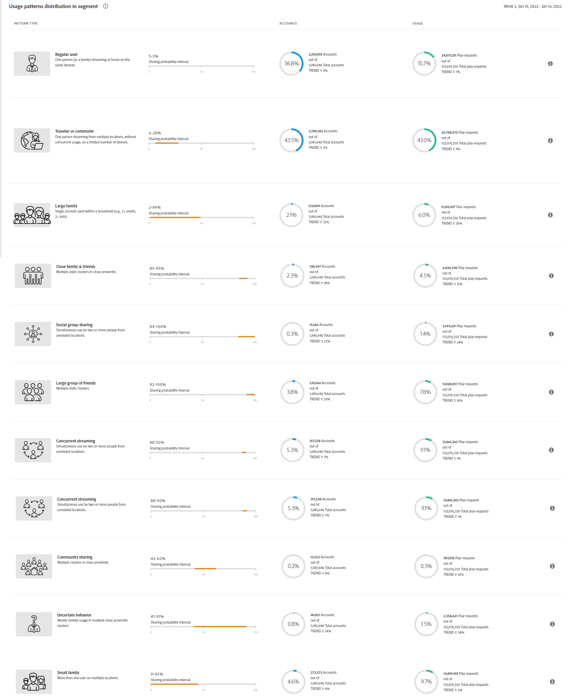
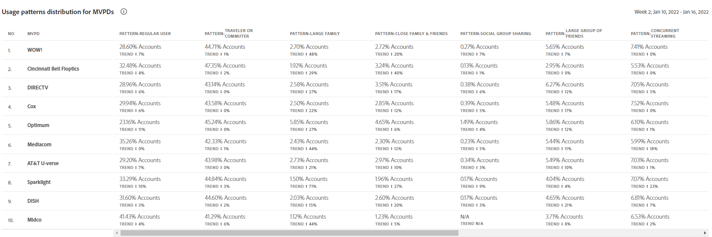

# Usage Patterns {#usage-patterns}

Account IQ classifies users of subscriber accounts into various categories in terms of their social behavior. The **Usage Patterns** page shows analytics and reports for these user typologies. For example, **Usage patterns distribution - Users in segment vs industry**

Once you define a segment by selecting MVPDs, Channels, and time frame from the [segment panel](help\AccountIQ\segments-timeframe.md), the reports are generated on this page for various user types based on their viewing behavior..  

The [!UICONTROL Usage Patterns] page has visuals that give you insights into account sharing and usage for different user typology or characteristics. Here, metrics extracted from the REPORTS are used to calculate risk indices. These are plotted on graph and are used to compare behavior of different user segments and also with the industry.  

