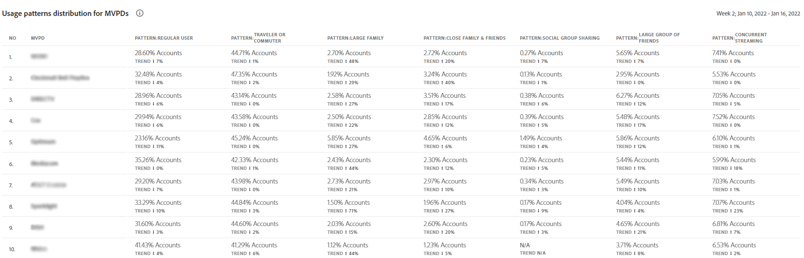

# Usage behavior and sharing patterns {#usage-behavior}

The [!UICONTROL Usage Patterns] page has visuals that give you insights into account sharing and usage for different user typology or characteristics. Here, metrics extracted from the REPORTS are used to calculate risk indices. These are plotted on graph and are used to compare behavior of different user segments and also with the industry.  

| ID          | User details                    |
|-------------|---------------------------------|
|     1       |     Regular user                |
|     2       |     Traveller or   commuter     |
|     3       |     Large family                |
|     4       |     Close family   & friends    |
|     5       |     Social group   sharing      |
|     6       |     Large group of   friends    |
|     7       |     Concurrent   streaming      |
|     8       |     Community   sharing         |
|     9-11    |     Uncertain   behavior        |
|     12      |     Small family                |
|     13      |     Second home                 |
|     14      |     Abnormal usage              |
