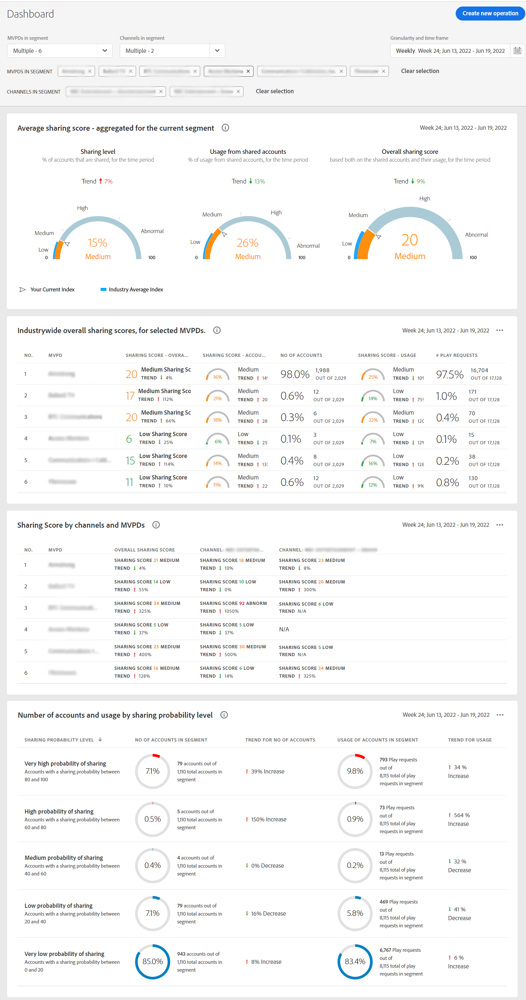

# View reports for multiple MVPDs <!--and channel programmers--> {#viewreport-multiple-mvpd-channel}

Account IQ being a robust and scalable analytics tool enables you to view, analyze, and compare subscriber accounts sharing statistics not only for one, two, or three but for more MVPDs at a given time.

>[!NOTE]
>
>However, as of now you can select at most 10 individual MVPDs from the segment and time frame panel to view subscriber sharing statistics.

To view subscriber account sharing statistics for multiple MVPDs:

1. Define a desired segment following the steps in [How to define segment and select timeframe](/help/AccountIQ/howto-select-segment-timeframe.md) for evaluation from [segment and timeframe panel](/help/AccountIQ/segments-timeframe.md).

1. Select a desired reports page from the left navigation:

* [Dashboard](/help/AccountIQ/dashboard.md) (dashboard gives a glimpse of the selected graphs from different reports pages).

  

  *Figure: Dashboard report for multiple MVPDs*

* [General Usage](/help/AccountIQ/general-usage-reports.md)

* [Shared Accounts](/help/AccountIQ/shared-acc-reports.md)

* [Usage Patterns](/help/AccountIQ/usage-patterns.md)

Each of these pages will reflect the activity.